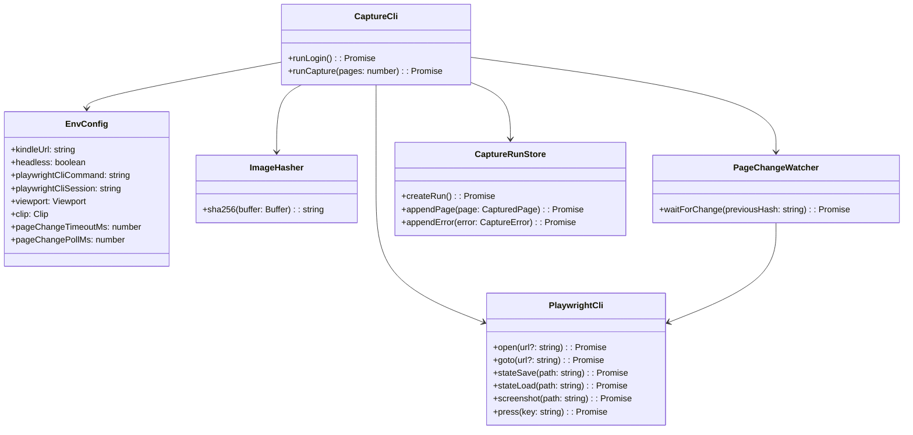
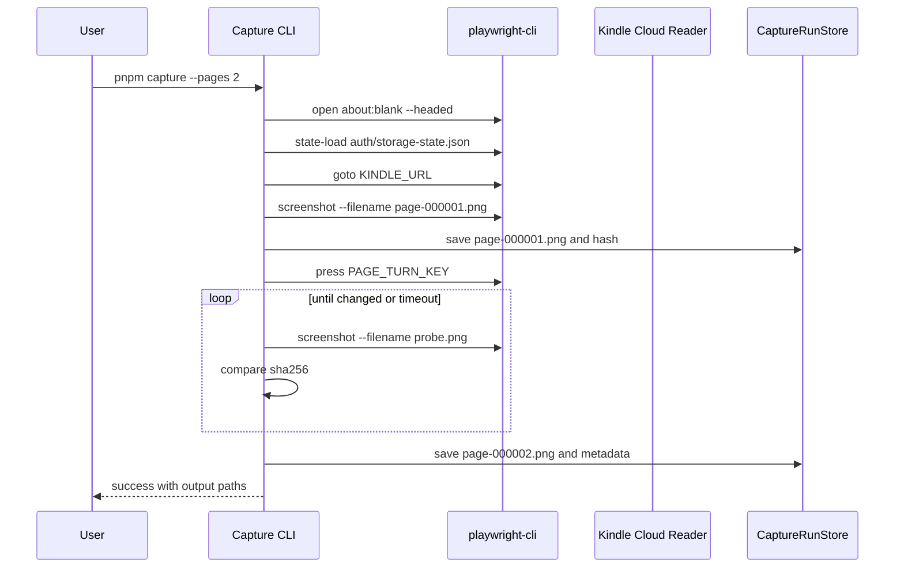
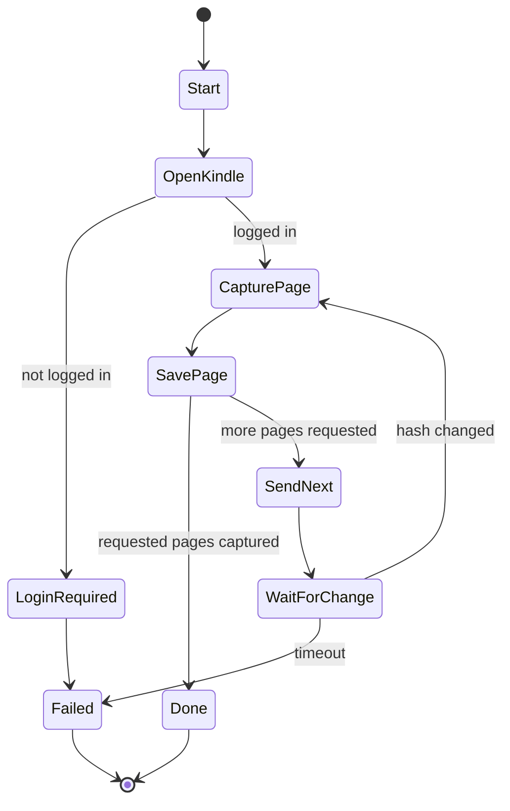

# Kindle Screenshot Capture MVP


## 1. 概要と目的 Overview and Purpose

- What  
  Kindle Cloud Reader を `playwright-cli` で操作し、表示中ページのスクリーンショットを PNG として保存する最初のMVPを実装する。
- Why  
  後続の OCR / TTS パイプラインに渡す安定した画像入力を作る。DRM解除やKindle内部解析は行わず、ユーザーが画面に表示しているページだけを対象にする。
- How  
  TypeScript CLI として `kindle:login` と `capture` コマンドを作り、`playwright-cli` の headed session、storage state、screenshot、press、hash polling によるページ変化検知を組み合わせる。

## 2. 仕様と受け入れ条件 Specification and Acceptance Criteria

### 2.1 スコープ Scope

- 今回やること
  - `playwright-cli open --headed` によるブラウザ起動
  - Kindle Cloud Reader の起動
  - 手動ログイン後の storage state 保存
  - storage state を使った再起動
  - 表示中ページのスクリーンショット保存
  - `PAGE_TURN_KEY` によるページ送り
  - `--turn-mode manual` による手動ページ送り
  - スクリーンショット hash によるページ変化検知
  - capture metadata JSON の保存
  - CLI、設定、ログ、最小テストの整備
- 成果物
  - `pnpm kindle:login`
  - `pnpm capture --pages <n>`
  - `auth/storage-state.json`
  - `data/screenshots/<run-id>/page-000001.png`
  - `data/capture-runs/<run-id>.json`
- 制約
  - ローカル実行限定
  - 初回ログインはユーザー手動
  - 初期MVPでは `playwright-cli screenshot` による表示中ページ保存を主経路にする

### 2.2 非スコープ Non Scope

- OCR、画像前処理、TTS、音声再生
- LLMによるOCR補正
- Kindleファイル解析、DRM解除、内部データ抽出
- Amazon制限回避、自動ログイン
- Web UI
- 複数書籍の高度な管理
- 連続100ページ処理の性能最適化

### 2.3 ユースケース Use Cases

- 正常系: 初回ログイン
  1. ユーザーが `pnpm kindle:login` を実行する
  2. Chromium が Kindle Cloud Reader を開く
  3. ユーザーが手動でログインする
  4. CLI が `auth/storage-state.json` を保存する

- 正常系: 1ページ取得
  1. CLI が既存の `playwright-cli` session を優先し、なければ Kindle Cloud Reader を開く
  2. ユーザーが対象書籍を開き、本文ページを表示して Enter を押す
  3. CLI が表示中ページを PNG として保存する
  4. CLI が metadata JSON を保存する

- 正常系: 複数ページ取得
  1. ユーザーが `pnpm capture --pages 3` を実行する
  2. CLI が1ページ目を保存する
  3. auto mode では CLI が `PAGE_TURN_KEY` でページ送りする
  4. manual mode ではユーザーが手動でページ送りして Enter を押す
  5. CLI が次ページを保存する

- 異常系: 未ログイン
  1. storage state が期限切れ、または未作成
  2. CLI が未ログインらしい状態を検出する
  3. CLI が `pnpm kindle:login` の再実行を促して終了する

- 異常系: ページ送り失敗
  1. `PAGE_TURN_KEY` 後も hash が変化しない
  2. CLI が timeout 後にエラーとして metadata とログに記録する
  3. CLI が非0終了する

### 2.4 受け入れ条件 Acceptance Criteria

- Given storage state が存在しない When `pnpm kindle:login` を実行し手動ログインを完了する Then `auth/storage-state.json` が作成される
- Given `auth/storage-state.json` が存在する When `pnpm capture --pages 1` を実行し本文ページ表示後に Enter を押す Then `data/screenshots/<run-id>/page-000001.png` が保存される
- Given Kindle の本文ページが表示されている When `pnpm capture --pages 1` を実行する Then 保存 PNG に表示中ページが含まれる
- Given 次ページが存在する When `pnpm capture --pages 2 --turn-mode manual` を実行し手動でページ送りする Then 2枚の PNG が保存され、metadata に異なる sha256 が記録される
- Given ページ送り後に表示が変わらない When page change timeout を超える Then CLI はエラーをログに出して非0終了する
- Given `.env` に clip 値が設定されている When capture を実行する Then その clip 値で screenshot が保存される

### 2.5 既知の制約 Known Limitations

- Kindle DOM selector は安定しない可能性があるため、初期MVPでは `playwright-cli screenshot` を主経路にする
- sha256 は完全一致比較なので、微小な描画差分の扱いは弱い
- 書籍や表示設定により clip 調整が必要
- Amazon側UI変更やログイン状態失効にはユーザー操作が必要

## 3. 前提技術スタック Context and Tech Stack

- Language Framework  
  TypeScript / Node.js / CLI application
- Libraries  
  @playwright/cli、commander、dotenv、zod、pino
- Style Guide  
  新規プロジェクトとして最小の TypeScript strict 設定を使う。既存設定が追加された場合はそれに従う。
- Runtime Deployment  
  ローカルPC上の Node.js 実行。配布やサーバーデプロイは対象外。
- Testing  
  Vitest を想定。Playwright 実ブラウザ操作は初期MVPでは手動確認を含む integration smoke test として扱う。

## 4. インターフェース契約 Interface Contracts

### 4.1 公開APIまたは外部I O一覧

- CLI
  - `pnpm kindle:login`
  - `pnpm capture --pages <number>`
  - `pnpm capture:debug`
- 設定ファイル
  - `.env`
- 永続化ストレージ
  - `auth/storage-state.json`
  - `data/screenshots/<run-id>/page-*.png`
  - `data/capture-runs/<run-id>.json`
- 外部サービス連携
  - Kindle Cloud Reader

### 4.2 データモデルとスキーマ

`.env` schema:

```ts
type Env = {
  KINDLE_URL: string;
  HEADLESS: boolean;
  BROWSER_CHANNEL?: string;
  PLAYWRIGHT_CLI_COMMAND: string;
  PLAYWRIGHT_CLI_SESSION: string;
  VIEWPORT_WIDTH: number;
  VIEWPORT_HEIGHT: number;
  CAPTURE_CLIP_X: number;
  CAPTURE_CLIP_Y: number;
  CAPTURE_CLIP_WIDTH: number;
  CAPTURE_CLIP_HEIGHT: number;
  PAGE_CHANGE_TIMEOUT_MS: number;
  PAGE_CHANGE_POLL_MS: number;
  PAGE_TURN_KEY: string;
};
```

capture run schema:

```ts
type CaptureRun = {
  runId: string;
  kindleUrl: string;
  viewport: {
    width: number;
    height: number;
  };
  clip: {
    x: number;
    y: number;
    width: number;
    height: number;
  };
  pages: CapturedPage[];
  errors: CaptureError[];
};

type CapturedPage = {
  index: number;
  screenshotPath: string;
  sha256: string;
  capturedAt: string;
};

type CaptureError = {
  code: "NOT_LOGGED_IN" | "PAGE_CHANGE_TIMEOUT" | "CAPTURE_FAILED" | "CONFIG_INVALID";
  message: string;
  pageIndex?: number;
  occurredAt: string;
};
```

バリデーション方針:

- `.env` は zod で起動時に検証する
- `pages` は 1 以上の整数のみ許可する
- clip の width / height は 1 以上、viewport 内に収まることを検証する

### 4.3 エラーと例外 Error Handling

- エラー分類
  - `CONFIG_INVALID`: `.env` や CLI 引数が不正
  - `NOT_LOGGED_IN`: Kindle Cloud Reader がログイン済みでない
  - `CAPTURE_FAILED`: screenshot 保存に失敗
  - `PAGE_CHANGE_TIMEOUT`: 指定時間内にページ hash が変化しない
- リトライ方針
  - screenshot hash polling は timeout まで繰り返す
  - ログイン失敗と storage state 失効は自動リトライしない
- タイムアウト方針
  - ページ変化待ちは `PAGE_CHANGE_TIMEOUT_MS`
  - polling 間隔は `PAGE_CHANGE_POLL_MS`
- ログ方針と個人情報の扱い
  - pino で runId、pageIndex、path、elapsedMs、error code を記録する
  - Amazonアカウント情報、cookie、storage state の中身はログ出力しない

### 4.4 代表的な例 Examples

`.env`:

```env
KINDLE_URL=https://read.amazon.co.jp/
HEADLESS=false
BROWSER_CHANNEL=
PLAYWRIGHT_CLI_COMMAND=playwright-cli
PLAYWRIGHT_CLI_SESSION=pagecaster
VIEWPORT_WIDTH=1600
VIEWPORT_HEIGHT=1200
CAPTURE_CLIP_X=160
CAPTURE_CLIP_Y=80
CAPTURE_CLIP_WIDTH=1280
CAPTURE_CLIP_HEIGHT=1040
PAGE_CHANGE_TIMEOUT_MS=10000
PAGE_CHANGE_POLL_MS=250
PAGE_TURN_KEY=ArrowLeft
```

初回ログイン:

```bash
pnpm kindle:login
```

3ページ取得:

```bash
pnpm capture --pages 3
```

手動ページ送り:

```bash
pnpm capture --pages 2 --turn-mode manual
```

metadata example:

```json
{
  "runId": "20260522-000001",
  "kindleUrl": "https://read.amazon.co.jp/",
  "viewport": {
    "width": 1600,
    "height": 1200
  },
  "clip": {
    "x": 160,
    "y": 80,
    "width": 1280,
    "height": 1040
  },
  "pages": [
    {
      "index": 1,
      "screenshotPath": "data/screenshots/20260522-000001/page-000001.png",
      "sha256": "example",
      "capturedAt": "2026-05-22T00:00:00.000Z"
    }
  ],
  "errors": []
}
```

## 5. アーキテクチャと設計図 Architecture and Diagrams

### 5.1 図の選択方針

CLI、ブラウザ操作、ファイル保存、設定、hash計算の複数境界を跨ぐため、クラス図を必須とする。ページ送りと変化検知は非同期状態が重要なので、シーケンス図も追加する。

### 5.2 クラス図 Class Diagram



### 5.3 その他の図 Optional





## 6. テスト戦略 Test Strategy

### 6.1 テストの種類

- Unit
  - `.env` validation
  - CLI引数 validation
  - runId 生成
  - screenshot path 生成
  - sha256 hash 計算
  - metadata append
  - page change watcher の timeout / changed 判定
- Integration
  - `playwright-cli` command runner を mock した capture flow
  - 実ブラウザ smoke test はローカル手動確認として `pnpm capture:debug` を使う
- Contract
  - `CaptureRun` JSON schema snapshot
  - `.env` の必須項目とデフォルト値
  - CLI終了コードと error code

### 6.2 カバレッジ対象

- 重要ロジック
  - 設定検証
  - metadata保存
  - hash比較
  - timeout制御
- エラー分岐
  - storage state 不在
  - 未ログイン
  - screenshot失敗
  - page change timeout
- 境界条件
  - `--pages 1`
  - `--pages 0`
  - clip が viewport 外
  - timeout が短すぎる設定

## 7. 実装タスクリスト Implementation Plan

### Phase 1 設計と準備

- [x] 要件と仕様の確定 受け入れ条件の確定
- [x] インターフェース契約の確定 スキーマと例の追加
- [x] Mermaid図の作成 更新
- [x] TypeScript / pnpm / @playwright/cli / Vitest の最小構成を作成
- [x] `src/config/env.ts` の型と validation 方針を作成

### Phase 2 CLIと設定の実装

- [x] Test `.env` validation の失敗するテストケースを作成 Red
- [x] Impl zod による `.env` validation を実装 Green
- [x] Refactor デフォルト値とエラーメッセージを整理
- [x] Test CLI `--pages` validation の失敗するテストケースを作成 Red
- [x] Impl `login` / `capture` / `capture:debug` の commander 定義を実装 Green
- [x] Docs README にコマンド概要を追加

### Phase 3 ログインとブラウザ起動

- [x] Test `PlaywrightCli` のコマンド生成テストを作成 Red
- [x] Impl `playwright-cli` open/state/screenshot/press 対応を実装 Green
- [x] Refactor ブラウザ操作を `playwright-cli` ラッパに隔離
- [x] Integration `pnpm kindle:login` で手動ログイン後に `auth/storage-state.json` を保存
- [x] Docs storage state と個人情報の扱いをREADMEに追記

### Phase 4 スクリーンショット取得

- [x] Test screenshot path と metadata 初期化の失敗するテストケースを作成 Red
- [x] Impl `CaptureRunStore` と保存先ディレクトリ作成を実装 Green
- [x] Test `playwright-cli screenshot` のコマンド生成テストを作成 Red
- [x] Impl `playwright-cli screenshot` による PNG 保存を実装 Green
- [x] Integration `pnpm capture --pages 1` で PNG と metadata JSON を保存
- [x] Docs `capture:debug` の使い方をREADMEに追記

### Phase 5 ページ送りと変化検知

- [x] Test sha256 hash 計算の失敗するテストケースを作成 Red
- [x] Impl `ImageHasher` を実装 Green
- [x] Test `PageChangeWatcher` の changed / timeout テストを作成 Red
- [x] Impl hash polling によるページ変化待ちを実装 Green
- [x] Refactor fixed sleep が混ざらないよう責務を整理
- [x] Integration `pnpm capture --pages 2 --turn-mode manual` で2ページ分の PNG と異なる hash を保存

### Phase 6 統合と検証

- [x] 全体テストの実行
- [x] `pnpm kindle:login` の手動確認
- [x] `pnpm capture --pages 1` の手動確認
- [x] `pnpm capture --pages 3` の手動確認
- [ ] エッジケースの動作確認 未ログイン タイムアウト 不正clip
- [x] ログと例外の確認 想定外入力 タイムアウト リトライ
- [x] ドキュメント更新 仕様 契約 図

## 8. 完了の定義 Definition of Done

### 8.1 機能DoD Functional DoD

- [ ] 受け入れ条件がすべて満たされていること
- [x] `pnpm kindle:login` で storage state を保存できること
- [x] `pnpm capture --pages 1` で表示中ページ PNG と metadata JSON を保存できること
- [x] `pnpm capture --pages 3` でページ送りと hash 変化検知を通して連続保存できること
- [ ] 既知の制約が明文化され、想定通りであること
- [x] 契約の例に対して期待通りの結果が得られること

### 8.2 品質DoD Quality DoD

- [x] 全てのテストがパスしていること
- [ ] Linter Formatter のエラーがないこと
- [ ] 不要なデバッグコードが削除されていること
- [ ] storage state や cookie がログに出力されないこと
- [x] 主要な変更点が README とこの計画書に反映されていること

## 9. 懸念事項と未確定事項 Concerns and Questions

- Kindle Cloud Reader の正式URLを `https://read.amazon.co.jp/` と `https://read.amazon.com/` のどちらにするか
- 初期MVPの `playwright-cli screenshot` は表示中ページ保存であり、本文領域だけの切り出しは後続で調整するか
- 縦書き・横書き・見開き表示で clip 戦略を分ける必要があるか
- `PAGE_TURN_KEY` の既定値 `ArrowLeft` が対象書籍や表示状態で常に次ページとして機能するか
- sha256 の完全一致比較でページ変化検知が十分か
- storage state の保存場所を暗号化するか、MVPではローカル平文を許容するか
- Playwright CLI での手動探索結果をどの程度コード化するか
