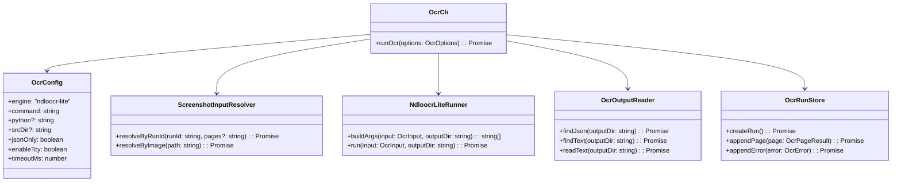
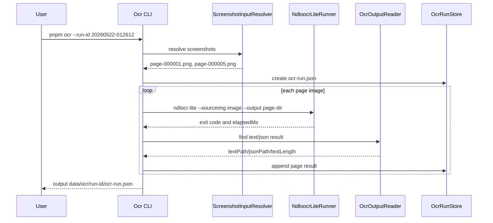
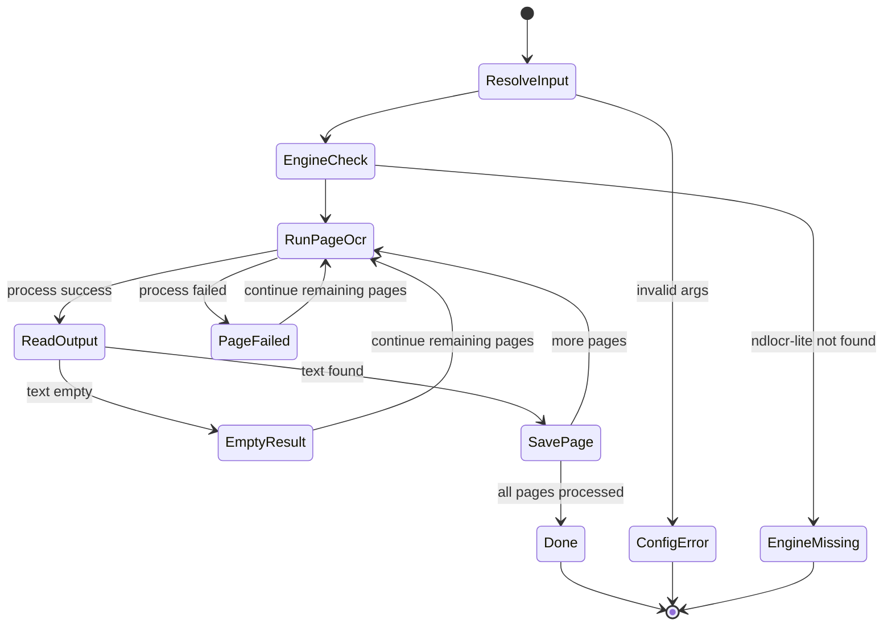

# NDLOCR-Lite OCR MVP

## 1. 概要と目的 Overview and Purpose

- What  
  既存の `data/screenshots/<run-id>/page-*.png` を入力として、NDLOCR-Lite で日本語縦書きOCRを実行し、ページ単位のOCR結果を `data/ocr/<run-id>/` に保存する。
- Why  
  Kindle Cloud Reader から取得したスクリーンショットを、後続の整形、LM Studio補正、Irodori-TTS に渡せるテキスト入力へ変換する。
- How  
  TypeScript CLI に `ocr` コマンドを追加し、NDLOCR-Lite CLI または Python実行を外部プロセスとして呼び出す。PageCaster側は入力検出、出力先管理、設定検証、ログ、エラー処理、metadata保存を担当する。

## 2. 仕様と受け入れ条件 Specification and Acceptance Criteria

### 2.1 スコープ Scope

- 今回やること
  - `pnpm ocr --run-id <run-id>` の追加
  - `pnpm ocr --image <path>` の追加
  - NDLOCR-Lite の実行コマンド生成
  - `--sourceimg` によるページ単位OCR
  - `--output` によるOCR出力先指定
  - `--json-only` と `--enable-tcy` の設定対応
  - OCR結果ファイルの探索と PageCaster metadata 保存
  - OCR失敗、空OCR結果、入力画像不在のエラー処理
  - NDLOCR-Lite未導入時に分かりやすいエラーを出す
- 成果物
  - `src/ocr/ndloocrLite.ts`
  - `src/ocr/ocrRunStore.ts`
  - `src/cli/ocr.ts`
  - `data/ocr/<run-id>/page-000001/`
  - `data/ocr/<run-id>/ocr-run.json`
  - README のOCR実行手順
- 制約
  - NDLOCR-Lite本体のインストールは自動化しない
  - 画像前処理は最小限に留め、必要になった時点で `sharp` を導入する
  - OCR結果整形、LM Studio補正、TTS連携は今回の非スコープ

### 2.2 非スコープ Non Scope

- OCR結果の自然文整形
- LM Studio によるOCR補正
- Irodori-TTS 連携
- OCR精度の本格チューニング
- 複数OCRエンジンの完全抽象化
- NDLOCR-Lite の依存関係インストール自動化
- GUI / Web UI

### 2.3 ユースケース Use Cases

- 正常系: capture run 全体をOCRする
  1. ユーザーが `pnpm capture --pages 5 --no-confirm-start` を実行済み
  2. `data/screenshots/<run-id>/page-*.png` が存在する
  3. ユーザーが `pnpm ocr --run-id <run-id>` を実行する
  4. CLI が各画像に NDLOCR-Lite を実行する
  5. CLI がOCR結果と `ocr-run.json` を保存する

- 正常系: 1枚だけOCRする
  1. ユーザーが `pnpm ocr --image data/screenshots/<run-id>/page-000001.png` を実行する
  2. CLI が画像1枚をOCRする
  3. CLI が `data/ocr/single-<timestamp>/` に結果を保存する

- 異常系: NDLOCR-Lite が見つからない
  1. `NDLOCR_LITE_COMMAND` も `NDLOCR_LITE_SRC_DIR` も利用できない
  2. CLI が `OCR_ENGINE_NOT_FOUND` を出す
  3. CLI がインストール手順を案内して非0終了する

- 異常系: OCR結果が空
  1. NDLOCR-Lite は終了コード0で完了する
  2. しかし抽出テキストが空
  3. CLI が `EMPTY_OCR_RESULT` を metadata に記録する

### 2.4 受け入れ条件 Acceptance Criteria

- Given `data/screenshots/<run-id>/page-000001.png` が存在する When `pnpm ocr --run-id <run-id>` を実行する Then `data/ocr/<run-id>/ocr-run.json` が保存される
- Given NDLOCR-Lite が利用可能 When `pnpm ocr --image <png>` を実行する Then NDLOCR-Lite に `--sourceimg <png> --output <dir>` が渡される
- Given `.env` で `NDLOCR_LITE_JSON_ONLY=true` When OCRを実行する Then NDLOCR-Lite に `--json-only` が渡される
- Given `.env` で `NDLOCR_LITE_ENABLE_TCY=true` When OCRを実行する Then NDLOCR-Lite に `--enable-tcy` が渡される
- Given 入力画像が存在しない When `pnpm ocr --image missing.png` を実行する Then `INPUT_IMAGE_NOT_FOUND` で非0終了する
- Given OCR結果が空 When OCR処理が完了する Then `EMPTY_OCR_RESULT` を記録し、後続処理に渡さない

### 2.5 既知の制約 Known Limitations

- NDLOCR-Lite の実際の出力ファイル名とJSON構造は環境バージョン差があり得るため、初期実装では出力ディレクトリ内の `.json` / `.txt` を探索する
- 縦書き順序補正はNDLOCR-Lite出力を優先し、PageCaster独自補正は今回実装しない
- `--sourcedir` 一括処理は将来拡張とし、MVPでは `--sourceimg` をページごとに呼ぶ
- OCR速度はNDLOCR-Lite環境に依存するため、MVPでは性能目標を測定のみとする

## 3. 前提技術スタック Context and Tech Stack

- Language Framework  
  TypeScript / Node.js / CLI application
- Libraries  
  commander、dotenv、zod、pino、Node.js child_process、fs/path
- Style Guide  
  既存の TypeScript strict 設定に従う
- Runtime Deployment  
  ローカルPC。NDLOCR-Lite は別途ローカルにインストール済み、または clone 済みとする
- Testing  
  Vitest。NDLOCR-Lite 実行は unit test では mock し、integration は実環境で任意実行する

## 4. インターフェース契約 Interface Contracts

### 4.1 公開APIまたは外部I O一覧

- CLI
  - `pnpm ocr --run-id <run-id>`
  - `pnpm ocr --image <path>`
  - `pnpm ocr --run-id <run-id> --pages 1-5`
- 設定ファイル
  - `.env`
- 永続化ストレージ
  - `data/screenshots/<run-id>/page-*.png`
  - `data/ocr/<run-id>/page-000001/`
  - `data/ocr/<run-id>/ocr-run.json`
- 外部プロセス
  - `ndlocr-lite --sourceimg <image> --output <dir>`
  - または `python <NDLOCR_LITE_SRC_DIR>/ocr.py --sourceimg <image> --output <dir>`

### 4.2 データモデルとスキーマ

`.env` schema:

```ts
type OcrEnv = {
  OCR_ENGINE: "ndloocr-lite";
  NDLOCR_LITE_COMMAND: string;
  NDLOCR_LITE_PYTHON?: string;
  NDLOCR_LITE_SRC_DIR?: string;
  NDLOCR_LITE_JSON_ONLY: boolean;
  NDLOCR_LITE_ENABLE_TCY: boolean;
  OCR_TIMEOUT_MS: number;
};
```

OCR run schema:

```ts
type OcrRun = {
  runId: string;
  sourceRunId?: string;
  engine: "ndloocr-lite";
  startedAt: string;
  completedAt?: string;
  pages: OcrPageResult[];
  errors: OcrError[];
};

type OcrPageResult = {
  index: number;
  sourceImagePath: string;
  outputDir: string;
  textPath?: string;
  jsonPath?: string;
  textLength: number;
  elapsedMs: number;
};

type OcrError = {
  code:
    | "OCR_ENGINE_NOT_FOUND"
    | "INPUT_IMAGE_NOT_FOUND"
    | "OCR_PROCESS_FAILED"
    | "EMPTY_OCR_RESULT"
    | "OCR_OUTPUT_NOT_FOUND"
    | "CONFIG_INVALID";
  message: string;
  pageIndex?: number;
  occurredAt: string;
};
```

バリデーション方針:

- `--run-id` と `--image` は同時指定不可
- `--run-id` または `--image` のどちらかは必須
- `--pages` は `1`, `1-5`, `1,3,5` を許可する
- `OCR_ENGINE` はMVPでは `ndloocr-lite` のみ許可する

### 4.3 エラーと例外 Error Handling

- エラー分類
  - `CONFIG_INVALID`: `.env` またはCLI引数が不正
  - `OCR_ENGINE_NOT_FOUND`: NDLOCR-Lite実行コマンドが見つからない
  - `INPUT_IMAGE_NOT_FOUND`: 入力画像が存在しない
  - `OCR_PROCESS_FAILED`: NDLOCR-Liteが非0終了
  - `OCR_OUTPUT_NOT_FOUND`: 出力ディレクトリに結果ファイルがない
  - `EMPTY_OCR_RESULT`: OCR結果テキストが空
- リトライ方針
  - MVPでは自動リトライしない
  - 失敗ページを metadata に記録し、後で再実行可能にする
- タイムアウト方針
  - ページ単位で `OCR_TIMEOUT_MS`
  - 既定値は `120000`
- ログ方針と個人情報の扱い
  - pinoで runId、pageIndex、sourceImagePath、outputDir、elapsedMs、error code を記録する
  - OCRテキスト全文はログに出さない
  - Kindle認証情報やstorage stateは扱わない

### 4.4 代表的な例 Examples

`.env`:

```env
OCR_ENGINE=ndloocr-lite
NDLOCR_LITE_COMMAND=ndlocr-lite
NDLOCR_LITE_PYTHON=
NDLOCR_LITE_SRC_DIR=
NDLOCR_LITE_JSON_ONLY=true
NDLOCR_LITE_ENABLE_TCY=false
OCR_TIMEOUT_MS=120000
```

capture run 全体OCR:

```bash
pnpm ocr --run-id 20260522-012612
```

1枚だけOCR:

```bash
pnpm ocr --image data/screenshots/20260522-012612/page-000001.png
```

## 5. アーキテクチャと設計図 Architecture and Diagrams

### 5.1 図の選択方針

CLI、設定、ファイル探索、外部プロセス実行、OCR metadata保存を跨ぐため、クラス図を必須とする。ページ単位の非同期処理と外部プロセス境界があるため、シーケンス図も追加する。

### 5.2 クラス図 Class Diagram



### 5.3 その他の図 Optional





## 6. テスト戦略 Test Strategy

### 6.1 テストの種類

- Unit
  - `.env` OCR設定 validation
  - CLI `--run-id` / `--image` / `--pages` validation
  - screenshot input resolver
  - NDLOCR-Lite command args builder
  - OCR output reader
  - OCR run metadata append
  - error mapping
- Integration
  - fake NDLOCR-Lite コマンドを使った end-to-end OCR flow
  - 実 NDLOCR-Lite 連携はローカル環境で任意 smoke test
- Contract
  - `ocr-run.json` schema snapshot
  - CLI終了コードと error code
  - NDLOCR-Liteに渡す引数の契約

### 6.2 カバレッジ対象

- 重要ロジック
  - 入力画像解決
  - ページ範囲指定
  - 外部コマンド引数生成
  - 出力ファイル探索
  - metadata保存
- エラー分岐
  - 入力画像なし
  - NDLOCR-Liteなし
  - 外部プロセス失敗
  - OCR結果なし
  - 空OCR結果
- 境界条件
  - 1ページのみ
  - 複数ページ
  - `--pages 1-3`
  - `--pages 1,3`
  - 出力先が既に存在する

## 7. 実装タスクリスト Implementation Plan

### Phase 1 設計と準備

- [x] 要件と仕様の確定 受け入れ条件の確定
- [x] インターフェース契約の確定 スキーマと例の追加
- [x] Mermaid図の作成 更新
- [x] `src/types.ts` に OCR 型定義を追加
- [x] `.env.example` と README に OCR 設定を追加
- [x] テスト基盤の確認 Vitest と fake command 方針の確認

### Phase 2 OCR設定とCLIの実装

- [x] Test OCR `.env` validation の失敗するテストケースを作成 Red
- [x] Impl OCR `.env` validation を実装 Green
- [x] Refactor 既存 `loadEnvConfig` との責務整理
- [x] Test `pnpm ocr` CLI 引数 validation の失敗するテストケースを作成 Red
- [x] Impl `ocr` command を commander に追加 Green
- [x] Docs README に `pnpm ocr` の使い方を追加

### Phase 3 入力画像解決とmetadata保存

- [x] Test `ScreenshotInputResolver` の run-id 解決テストを作成 Red
- [x] Impl `data/screenshots/<run-id>/page-*.png` の探索を実装 Green
- [x] Test `--pages` 範囲指定のテストを作成 Red
- [x] Impl `1`, `1-5`, `1,3,5` の page filter を実装 Green
- [x] Test `OcrRunStore` の metadata 作成テストを作成 Red
- [x] Impl `data/ocr/<run-id>/ocr-run.json` 保存を実装 Green

### Phase 4 NDLOCR-Lite実行

- [x] Test `NdloocrLiteRunner.buildArgs` のテストを作成 Red
- [x] Impl `--sourceimg` `--output` `--json-only` `--enable-tcy` の引数生成 Green
- [x] Test fake command による成功ケースを作成 Red
- [x] Impl child_process による NDLOCR-Lite 実行 Green
- [x] Refactor 外部プロセス実行を runner に隔離
- [x] Test timeout と非0終了のテストを追加

### Phase 5 OCR出力読み取り

- [x] Test `OcrOutputReader` の json/text 探索テストを作成 Red
- [x] Impl OCR出力ディレクトリから `.json` / `.txt` を探索 Green
- [x] Test 空OCR結果のテストを作成 Red
- [x] Impl `EMPTY_OCR_RESULT` 記録 Green
- [x] Integration 実 NDLOCR-Lite で `pnpm ocr --image` を確認

### Phase 6 統合と検証

- [x] 全体テストの実行
- [x] `pnpm ocr --image <png>` の実 NDLOCR-Lite smoke test
- [x] 実 NDLOCR-Lite が利用可能なら `pnpm ocr --image` の実行確認
- [x] `pnpm ocr --run-id <run-id>` の実行確認
- [x] エッジケースの動作確認 入力なし エンジンなし 空OCR タイムアウト
- [x] ログと例外の確認
- [x] ドキュメント更新 仕様 契約 図

## 8. 完了の定義 Definition of Done

### 8.1 機能DoD Functional DoD

- [x] 受け入れ条件がすべて満たされていること
- [x] `pnpm ocr --image <png>` で NDLOCR-Lite を呼び出せること
- [x] `pnpm ocr --run-id <run-id>` で複数ページをOCRできること
- [x] `data/ocr/<run-id>/ocr-run.json` が保存されること
- [x] OCR失敗ページが metadata に記録されること
- [x] 既知の制約が明文化され、想定通りであること

### 8.2 品質DoD Quality DoD

- [x] 全てのテストがパスしていること
- [x] TypeScript typecheck がパスしていること
- [x] 不要なデバッグコードが削除されていること
- [x] OCRテキスト全文をログ出力していないこと
- [x] 主要な変更点が README とこの計画書に反映されていること

## 9. 懸念事項と未確定事項 Concerns and Questions

- NDLOCR-Lite を `uv tool install .` で使うか、clone済み `src/ocr.py` を Python で呼ぶか
- Windows環境で `python` / `python3` / `py` のどれを既定にするか
- NDLOCR-Lite の出力JSON形式をどの粒度で PageCaster metadata に取り込むか
- OCR結果テキストの抽出元を `.txt` 優先にするか `.json` から生成するか
- Kindleスクリーンショットがページ全体の場合、OCR前に本文領域cropを先に実装すべきか
- `--json-only` の場合にテキスト保存を PageCaster 側で生成するか
- 実NDLOCR-Liteの処理時間が長い場合、ページ単位並列実行を許容するか
