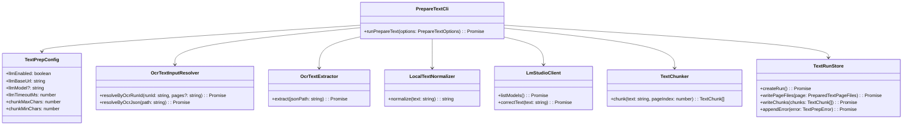
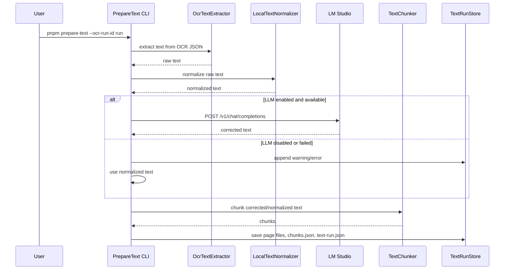
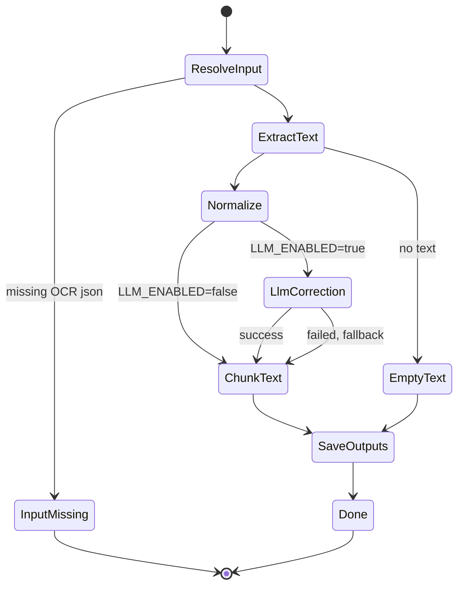

# LM Studio TTS Text Chunking MVP

> 後継設計: ページ全文をLM Studioで自由生成補正する方式は、`260523-s03-safe-chunk-edit-correction.md` の chunk単位edit候補方式へ置き換える。

## 1. 概要と目的 Overview and Purpose

- What  
  NDLOCR-Lite のOCR結果を読み取り、LM Studio でTTS向けの自然な本文に補正し、Irodori-TTSへ渡しやすい文単位チャンクとして保存する。
- Why  
  OCR結果をそのままTTSに渡すと、誤認識、不自然な改行、ページ由来のノイズ、長すぎる入力により読み上げ品質が落ちる。TTS前に本文補正とチャンク化を挟み、後続の音声生成を安定させる。
- How  
  TypeScript CLI に `prepare-text` コマンドを追加する。`data/ocr/<run-id>/ocr-run.json` からOCR JSONを解決し、テキスト抽出、ローカル整形、LM Studio OpenAI互換APIによる補正、文単位chunking、metadata保存を行う。

## 2. 仕様と受け入れ条件 Specification and Acceptance Criteria

### 2.1 スコープ Scope

- 今回やること
  - `pnpm prepare-text --ocr-run-id <run-id>` の追加
  - `pnpm prepare-text --ocr-json <path>` の追加
  - OCR JSONから本文テキストを抽出する
  - ページ番号、明らかなUI文字、過剰空白、重複改行を除去する
  - LM Studio `/v1/chat/completions` でOCR補正する
  - LM Studio未接続時に補正前テキストへフォールバックする
  - TTS向けに文単位チャンクへ分割する
  - `data/text/<run-id>/` に raw / corrected / chunks / metadata を保存する
  - OCRテキスト全文をログに出さない
- 成果物
  - `src/text/ocrTextExtractor.ts`
  - `src/text/localTextNormalizer.ts`
  - `src/text/lmStudioClient.ts`
  - `src/text/textChunker.ts`
  - `src/text/textRunStore.ts`
  - `src/cli/prepare-text.ts`
  - `data/text/<run-id>/text-run.json`
  - `data/text/<run-id>/page-000001.raw.txt`
  - `data/text/<run-id>/page-000001.corrected.txt`
  - `data/text/<run-id>/chunks.json`
- 制約
  - Irodori-TTSへの音声生成リクエストは今回行わない
  - LM Studioのモデル選択やプロンプト最適化は最小限にする
  - OCR精度改善や画像前処理は今回の非スコープ
  - 外部クラウドLLMには送信しない

### 2.2 非スコープ Non Scope

- Irodori-TTS API呼び出し
- 音声ファイル生成
- 音声再生
- sentence timing / 字幕生成
- OCR画像前処理
- 複数ページをまたぐ高度な文脈補正
- 本文の要約や翻訳

### 2.3 ユースケース Use Cases

- 正常系: OCR run 全体をTTS向けテキストへ変換する
  1. ユーザーが `pnpm ocr --run-id <run-id>` を実行済み
  2. `data/ocr/<run-id>/ocr-run.json` が存在する
  3. ユーザーが `pnpm prepare-text --ocr-run-id <run-id>` を実行する
  4. CLI がOCR JSONを読み取り、LM Studioで補正する
  5. CLI が `data/text/<run-id>/chunks.json` を保存する

- 正常系: 1ページ分だけ変換する
  1. ユーザーが `pnpm prepare-text --ocr-json data/ocr/<run-id>/page-000001/page-000001.json` を実行する
  2. CLI が1ページ分のOCR JSONを本文テキストにする
  3. CLI が補正済みテキストとチャンクを保存する

- 異常系: LM Studioが停止している
  1. `LLM_ENABLED=true`
  2. LM Studio `http://192.168.10.37:1234/v1` に接続できない
  3. CLI が `LLM_REQUEST_FAILED` を記録する
  4. CLI はローカル整形済みテキストを使ってchunkingを続行する

- 異常系: OCR結果が空
  1. OCR JSONから本文を抽出できない
  2. CLI が `EMPTY_TEXT_INPUT` を記録する
  3. そのページはchunksに含めない

### 2.4 受け入れ条件 Acceptance Criteria

- Given `data/ocr/<run-id>/ocr-run.json` が存在する When `pnpm prepare-text --ocr-run-id <run-id>` を実行する Then `data/text/<run-id>/text-run.json` と `chunks.json` が保存される
- Given LM Studio が利用可能 When `LLM_ENABLED=true` で実行する Then `/v1/chat/completions` にOCRテキスト補正リクエストが送られる
- Given LM Studio が利用不可 When `LLM_ENABLED=true` で実行する Then `LLM_REQUEST_FAILED` を記録し、ローカル整形済みテキストでchunksを保存する
- Given `LLM_ENABLED=false` When `prepare-text` を実行する Then LM Studioへ接続せずローカル整形とchunkingのみ行う
- Given 1チャンクの文字数上限が `TEXT_CHUNK_MAX_CHARS=240` When 長文を処理する Then 各chunkの文字数が上限以下になる
- Given OCRテキストが空 When `prepare-text` を実行する Then `EMPTY_TEXT_INPUT` を記録し、空chunkを作らない

### 2.5 既知の制約 Known Limitations

- NDLOCR-Lite JSON構造に対する抽出ロジックは初期実装では再帰的な `text` 系キー探索を使う
- LM Studio補正はページ単位で行い、ページをまたぐ文脈補正はしない
- チャンク境界は句点、疑問符、感嘆符、閉じ括弧を中心にした簡易ルールから開始する
- TTS向け読み調整、読み仮名、アクセント調整は今回扱わない

## 3. 前提技術スタック Context and Tech Stack

- Language Framework  
  TypeScript / Node.js / CLI application
- Libraries  
  commander、dotenv、zod、pino、Node.js fetch、fs/path
- Style Guide  
  既存の TypeScript strict 設定に従う
- Runtime Deployment  
  ローカルPC。LM Studio は `http://192.168.10.37:1234` でアクセス可能とする
- Testing  
  Vitest。LM Studio HTTPはunit testではmockし、実LM Studio連携は任意 smoke test とする

## 4. インターフェース契約 Interface Contracts

### 4.1 公開APIまたは外部I O一覧

- CLI
  - `pnpm prepare-text --ocr-run-id <run-id>`
  - `pnpm prepare-text --ocr-json <path>`
  - `pnpm prepare-text --ocr-run-id <run-id> --pages 1-3`
- 設定ファイル
  - `.env`
- 永続化ストレージ
  - `data/ocr/<run-id>/ocr-run.json`
  - `data/ocr/<run-id>/page-000001/*.json`
  - `data/text/<run-id>/text-run.json`
  - `data/text/<run-id>/chunks.json`
- 外部サービス
  - `GET http://192.168.10.37:1234/v1/models`
  - `POST http://192.168.10.37:1234/v1/chat/completions`

### 4.2 データモデルとスキーマ

`.env` schema:

```ts
type TextPrepEnv = {
  LLM_ENABLED: boolean;
  LLM_PROVIDER: "lmstudio";
  LLM_BASE_URL: string;
  LLM_MODEL?: string;
  LLM_TIMEOUT_MS: number;
  TEXT_CHUNK_MAX_CHARS: number;
  TEXT_CHUNK_MIN_CHARS: number;
};
```

text run schema:

```ts
type TextRun = {
  runId: string;
  sourceOcrRunId?: string;
  llmEnabled: boolean;
  llmModel?: string;
  startedAt: string;
  completedAt?: string;
  pages: PreparedTextPage[];
  chunks: TextChunk[];
  errors: TextPrepError[];
};

type PreparedTextPage = {
  index: number;
  sourceJsonPath: string;
  rawTextPath: string;
  normalizedTextPath: string;
  correctedTextPath?: string;
  rawTextLength: number;
  correctedTextLength: number;
  usedLlm: boolean;
  elapsedMs: number;
};

type TextChunk = {
  id: string;
  pageIndex: number;
  order: number;
  text: string;
  charLength: number;
};

type TextPrepError = {
  code:
    | "INPUT_OCR_NOT_FOUND"
    | "EMPTY_TEXT_INPUT"
    | "LLM_REQUEST_FAILED"
    | "LLM_RESPONSE_INVALID"
    | "CONFIG_INVALID";
  message: string;
  pageIndex?: number;
  occurredAt: string;
};
```

LM Studio chat request:

```ts
type ChatCompletionRequest = {
  model?: string;
  messages: Array<{
    role: "system" | "user";
    content: string;
  }>;
  temperature: number;
  stream: false;
};
```

### 4.3 エラーと例外 Error Handling

- エラー分類
  - `INPUT_OCR_NOT_FOUND`: OCR metadata または OCR JSON が存在しない
  - `EMPTY_TEXT_INPUT`: OCR JSONから本文を抽出できない
  - `LLM_REQUEST_FAILED`: LM Studio HTTPリクエスト失敗、timeout、非2xx
  - `LLM_RESPONSE_INVALID`: LM Studioレスポンスから本文を取得できない
  - `CONFIG_INVALID`: `.env` またはCLI引数が不正
- リトライ方針
  - MVPでは自動リトライしない
  - LM Studio失敗時はローカル整形済みテキストでフォールバックする
- タイムアウト方針
  - LM Studioリクエストは `LLM_TIMEOUT_MS`
- ログ方針と個人情報の扱い
  - pageIndex、elapsedMs、textLength、chunkCount、error code を記録する
  - OCR本文全文、補正済み本文全文、チャンク本文全文はログに出さない

### 4.4 代表的な例 Examples

`.env`:

```env
LLM_ENABLED=true
LLM_PROVIDER=lmstudio
LLM_BASE_URL=http://192.168.10.37:1234/v1
LLM_MODEL=
LLM_TIMEOUT_MS=120000
TEXT_CHUNK_MAX_CHARS=240
TEXT_CHUNK_MIN_CHARS=40
```

OCR run 全体を整形:

```bash
pnpm prepare-text --ocr-run-id 20260522-012612
```

LM Studioを使わずローカル整形のみ:

```bash
LLM_ENABLED=false pnpm prepare-text --ocr-run-id 20260522-012612
```

## 5. アーキテクチャと設計図 Architecture and Diagrams

### 5.1 図の選択方針

OCR JSON入力、LM Studio HTTP、チャンク保存、metadata保存の複数境界を跨ぐため、クラス図を必須とする。LM Studio失敗時のフォールバックが重要なので、シーケンス図と状態遷移図も追加する。

### 5.2 クラス図 Class Diagram



### 5.3 その他の図 Optional





## 6. テスト戦略 Test Strategy

### 6.1 テストの種類

- Unit
  - `.env` text prep設定 validation
  - CLI `--ocr-run-id` / `--ocr-json` / `--pages` validation
  - OCR JSON text extraction
  - local text normalization
  - LM Studio request builder and response parser
  - LM Studio failure fallback
  - chunking max/min length
  - text-run metadata保存
- Integration
  - fake LM Studio HTTP server を使った `prepare-text` flow
  - 実 LM Studio `http://192.168.10.37:1234` との smoke test
- Contract
  - `chunks.json` schema snapshot
  - `text-run.json` schema snapshot
  - LM Studio `/v1/chat/completions` request contract

### 6.2 カバレッジ対象

- 重要ロジック
  - OCR JSONからのテキスト抽出
  - LM Studio失敗時のフォールバック
  - チャンク長制御
  - metadata保存
- エラー分岐
  - OCR JSONなし
  - 空OCR
  - LM Studio timeout
  - LM Studioレスポンス不正
- 境界条件
  - 1文が上限を超える
  - 句点がない長文
  - 会話文の閉じ括弧
  - LLM補正結果が空

## 7. 実装タスクリスト Implementation Plan

### Phase 1 設計と準備

- [x] 要件と仕様の確定 受け入れ条件の確定
- [x] インターフェース契約の確定 スキーマと例の追加
- [x] Mermaid図の作成 更新
- [x] `src/types.ts` に TextPrep 型定義を追加
- [x] `.env.example` と README に text prep 設定を追加
- [x] テスト基盤の確認 fake LM Studio 方針の確認

### Phase 2 OCR入力解決とテキスト抽出

- [x] Test `OcrTextInputResolver` の run-id 解決テストを作成 Red
- [x] Impl `data/ocr/<run-id>/ocr-run.json` からOCR JSON一覧を解決 Green
- [x] Test `OcrTextExtractor` のNDLOCR-Lite JSON抽出テストを作成 Red
- [x] Impl 再帰的な text系キー抽出を実装 Green
- [x] Refactor OCR output reader との重複を整理

### Phase 3 ローカル整形とchunking

- [x] Test `LocalTextNormalizer` の改行 空白 ページノイズ除去テストを作成 Red
- [x] Impl local normalize を実装 Green
- [x] Test `TextChunker` の上限文字数テストを作成 Red
- [x] Impl 句点・閉じ括弧ベースの chunking を実装 Green
- [x] Test 句点がない長文のfallback splitを追加

### Phase 4 LM Studio連携

- [x] Test `LmStudioClient` の request builder テストを作成 Red
- [x] Impl `/v1/chat/completions` 呼び出しを実装 Green
- [x] Test LM Studio response parser テストを作成 Red
- [x] Impl choices[0].message.content 抽出を実装 Green
- [x] Test timeout / 非2xx / 空レスポンスのfallbackテストを作成
- [x] Docs LM Studio接続確認手順をREADMEに追加

### Phase 5 保存とCLI統合

- [x] Test `TextRunStore` の metadata 保存テストを作成 Red
- [x] Impl raw / normalized / corrected / chunks / text-run 保存 Green
- [x] Test `prepare-text` CLI validation テストを作成 Red
- [x] Impl `pnpm prepare-text` command を追加 Green
- [x] Integration fake LM Studio と `--ocr-json` 入力を確認
- [x] Integration `LLM_ENABLED=false` fallback flow を確認

### Phase 6 統合と検証

- [x] 全体テストの実行
- [x] 実 LM Studio で `pnpm prepare-text --ocr-run-id <run-id>` を確認
- [x] LM Studio停止時のfallback確認
- [x] `chunks.json` の文字数と文境界確認
- [x] ログに本文全文が出ていないことを確認
- [x] ドキュメント更新 仕様 契約 図

## 8. 完了の定義 Definition of Done

### 8.1 機能DoD Functional DoD

- [x] 受け入れ条件がすべて満たされていること
- [x] `pnpm prepare-text --ocr-json <path>` が動くこと
- [x] `pnpm prepare-text --ocr-run-id <run-id>` が動くこと
- [x] LM Studio利用時に補正済みテキストが保存されること
- [x] LM Studio失敗時にローカル整形済みテキストでfallbackすること
- [x] `chunks.json` がTTSへ渡せる粒度で保存されること

### 8.2 品質DoD Quality DoD

- [x] 全てのテストがパスしていること
- [x] TypeScript typecheck がパスしていること
- [x] 不要なデバッグコードが削除されていること
- [x] OCR本文、補正本文、チャンク本文全文をログ出力していないこと
- [x] 主要な変更点が README とこの計画書に反映されていること

## 9. 懸念事項と未確定事項 Concerns and Questions

- LM Studioでロード中のモデル名を明示指定するか、`/v1/models` の先頭を使うか
- OCR JSONのどのフィールドが最も安定した本文抽出元か
- ページ単位補正だとページ跨ぎ文が不自然になる可能性
- TTS向けチャンクの最適文字数を何文字にするか
- LM Studio補正で本文の意味が変わらないよう、どこまで厳格なプロンプトにするか
- Irodori-TTS が要求する入力制限や推奨句読点形式を次フェーズで確認する必要がある
- 長いページをそのままLM Studioへ送ると時間がかかるため、MVPでは `LLM_TIMEOUT_MS=120000` を推奨し、次フェーズで補正前分割を検討する
