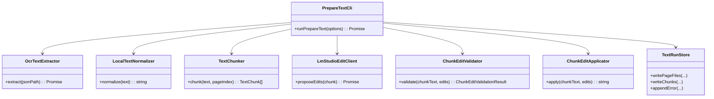
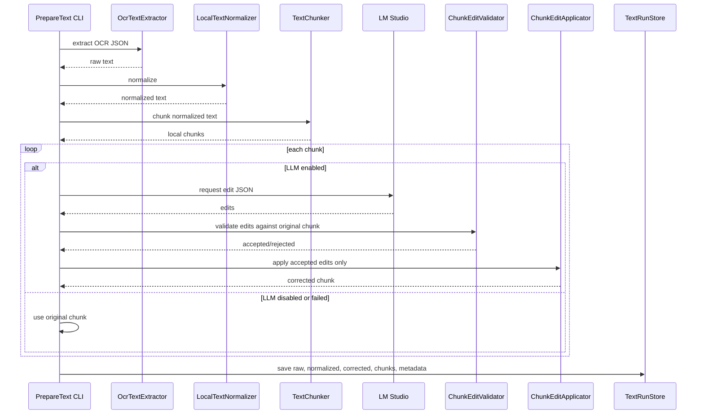
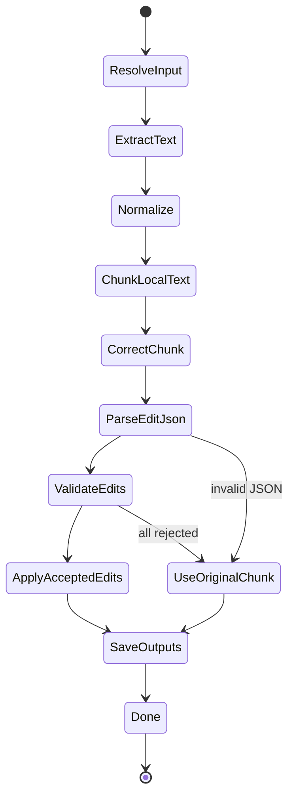

# Safe Chunk Edit Correction MVP

## 1. 概要と目的 Overview and Purpose

- What  
  現在の `prepare-text` の LM Studio 補正を、ページ全文の自由生成から、TTS chunk 単位の安全な edit 候補方式へ変更する。
- Why  
  ページ全文をLLMに渡して校正済み本文を返させる方式では、省略、推測補完、順序変更、本文の再構成が起きやすい。TTS用途では、多少OCR誤りが残るより、本文が捏造・省略されるほうが危険である。
- How  
  ローカル整形後に先にchunk化し、各chunkについてLM Studioから修正候補 `edits` のみをJSONで受け取る。アプリ側が候補を検証し、元テキスト内に存在する文字列への限定置換だけを適用する。検証に落ちた候補は捨て、元chunkを採用する。

## 2. 仕様と受け入れ条件 Specification and Acceptance Criteria

### 2.1 スコープ Scope

- 今回やること
  - `prepare-text` の内部処理順を `normalize -> page LLM correction -> chunk` から `normalize -> chunk -> chunk edit correction` へ変更する
  - LM Studio に本文全体を返させず、JSONの `edits` だけを返させる
  - `edits.from` が元chunk内に存在する場合だけ置換する
  - 変更量、数字、禁止語、JSON schema を検証する
  - 検証に落ちたchunkはローカル整形済みchunkを採用する
  - `chunks.json` に最終TTS用chunkを保存する
  - `text-run.json` にchunkごとのLLM利用状況と拒否理由を記録する
  - LM Studio停止時は全chunkをローカル整形済みのまま保存する
- 成果物
  - `src/text/chunkEditCorrector.ts`
  - `src/text/chunkEditValidator.ts`
  - `src/text/chunkEditApplicator.ts`
  - `src/text/lmStudioEditClient.ts` または既存 `LmStudioClient` の edit API 拡張
  - `src/types.ts` の edit correction 型追加
  - `src/cli/prepare-text.ts` の処理順変更
  - `tests/text/chunkEdit*.test.ts`
  - `tests/cli/prepare-text.test.ts` の統合テスト更新
- 制約
  - Irodori-TTSへの音声生成は今回行わない
  - OCR画像前処理は今回行わない
  - ページまたぎの文脈補完は行わない
  - LLMには外部クラウドではなくLM Studioのみを使う
  - LLM出力の自由本文は採用しない

### 2.2 非スコープ Non Scope

- 音声ファイル生成
- 読み仮名、アクセント、イントネーション指定
- 高度な日本語形態素解析
- OCRエンジン変更
- ページ間で途切れた文章の意味的な補完
- LLMによる要約、翻訳、書き換え

### 2.3 ユースケース Use Cases

- 正常系: chunkごとに安全なOCR誤りだけ補正する
  1. ユーザーが `pnpm prepare-text --ocr-run-id 20260522-012612 --pages 2-4` を実行する
  2. CLI がOCR JSONを読み取り、ローカル整形する
  3. CLI がローカル整形済み本文をTTS向けchunkへ分割する
  4. CLI が各chunkをLM Studioへ送り、修正候補JSONを受け取る
  5. CLI が検証済みの置換だけ適用し、`chunks.json` を保存する

- 異常系: LMが省略や推測補完を含む候補を返す
  1. LMが `from` に存在しない文字列や、数字を勝手に追加する `to` を返す
  2. validator が候補を reject する
  3. CLI は該当chunkを元のローカル整形済みchunkのまま保存する
  4. `text-run.json` に reject reason を記録する

- 異常系: LM Studioが停止している
  1. `LLM_ENABLED=true`
  2. LM Studio接続が失敗する
  3. 該当chunkに `LLM_REQUEST_FAILED` を記録する
  4. 元chunkを採用して処理を続ける

### 2.4 受け入れ条件 Acceptance Criteria

- Given OCR run が存在する When `pnpm prepare-text --ocr-run-id <run-id>` を実行する Then `chunks.json` と `text-run.json` が保存される
- Given `LLM_ENABLED=false` When `prepare-text` を実行する Then LM Studioへ接続せずローカル整形済みchunkを保存する
- Given LM Studioがedit候補JSONを返す When `edits.from` が元chunk内に存在する Then 該当箇所だけ置換される
- Given LM Studioが元chunkに存在しない `from` を返す When validationする Then そのeditはrejectされる
- Given LM Studioが出力本文を省略する候補を返す When validationする Then chunk全体または該当editはrejectされる
- Given 入力にない数字が `to` に追加される When validationする Then そのeditはrejectされる
- Given LM StudioのJSONが壊れている When parseする Then `LLM_RESPONSE_INVALID` を記録し元chunkへfallbackする
- Given 1chunkが `TEXT_CHUNK_MAX_CHARS` 以下 When 処理する Then 最終chunkも上限以下を維持する
- Given ログ出力 When 実行する Then OCR本文、補正本文、chunk本文全文をログに出さない

### 2.5 既知の制約 Known Limitations

- `from` の単純置換では、同じ誤字が複数箇所にある場合に全置換するか1回だけ置換するかの方針が必要
- 文脈が短いため、固有名詞や数字の高度な補正は抑制される
- LLM edit候補は保守的にrejectされるため、OCR誤りが残ることがある
- ページ末尾と次ページ冒頭にまたがる文の補正は今回扱わない

## 3. 前提技術スタック Context and Tech Stack

- Language Framework  
  TypeScript / Node.js / CLI application
- Libraries  
  commander、dotenv、zod、pino、Node.js fetch、fs/path、Vitest
- Runtime Deployment  
  ローカルPC。LM Studio は `http://192.168.10.37:1234/v1` のOpenAI互換APIを使う
- Style Guide  
  既存の strict TypeScript と現在のCLI構成に従う

## 4. インターフェース契約 Interface Contracts

### 4.1 公開APIまたは外部I O一覧

- CLI
  - `pnpm prepare-text --ocr-run-id <run-id>`
  - `pnpm prepare-text --ocr-json <path>`
  - `pnpm prepare-text --ocr-run-id <run-id> --pages 2-4`
- 設定
  - `LLM_ENABLED`
  - `LLM_BASE_URL`
  - `LLM_MODEL`
  - `LLM_TIMEOUT_MS`
  - `TEXT_CHUNK_MAX_CHARS`
  - `TEXT_CHUNK_MIN_CHARS`
  - 追加候補: `LLM_CORRECTION_MODE=edits`
  - 追加候補: `LLM_MAX_EDIT_RATIO=0.25`
- 永続化
  - `data/text/<run-id>/page-000001.raw.txt`
  - `data/text/<run-id>/page-000001.normalized.txt`
  - `data/text/<run-id>/page-000001.corrected.txt`
  - `data/text/<run-id>/chunks.json`
  - `data/text/<run-id>/text-run.json`

### 4.2 データモデルとスキーマ

LM Studio edit response:

```ts
type LlmEditResponse = {
  edits: Array<{
    from: string;
    to: string;
    reason?: string;
  }>;
};
```

内部検証結果:

```ts
type ChunkEdit = {
  from: string;
  to: string;
  reason?: string;
};

type ChunkEditValidationResult = {
  accepted: ChunkEdit[];
  rejected: Array<{
    edit: ChunkEdit;
    code:
      | "FROM_NOT_FOUND"
      | "EMPTY_FROM"
      | "EMPTY_TO"
      | "TOO_MUCH_CHANGE"
      | "ADDS_UNSEEN_NUMBER"
      | "ADDS_OMISSION_MARKER"
      | "SCHEMA_INVALID";
    message: string;
  }>;
};
```

`TextChunk` 拡張案:

```ts
type TextChunk = {
  id: string;
  pageIndex: number;
  order: number;
  text: string;
  charLength: number;
  correction?: {
    usedLlm: boolean;
    acceptedEditCount: number;
    rejectedEditCount: number;
    fallbackReason?: string;
  };
};
```

### 4.3 LM Studio Prompt Contract

System prompt 方針:

```text
あなたはOCR誤りの修正候補だけを返すエンジンです。
本文全文を返してはいけません。
JSONのみを返してください。
入力chunk内に存在する文字列を from に指定し、その置換候補を to に指定してください。
入力にない内容、推測した数字、要約、省略、続きを追加してはいけません。
修正不要なら {"edits":[]} を返してください。
```

User prompt 方針:

```text
<chunk id="p000002-c001">
...元chunk...
</chunk>

Return JSON only:
{"edits":[{"from":"...","to":"...","reason":"..."}]}
```

### 4.4 エラーと例外 Error Handling

- `LLM_REQUEST_FAILED`: HTTP失敗、timeout、非2xx
- `LLM_RESPONSE_INVALID`: JSON parse失敗、schema不一致、本文全文を返した疑い
- `LLM_EDIT_REJECTED`: edit候補は返ったが、検証で採用できなかった
- `EMPTY_TEXT_INPUT`: OCR JSONから本文を抽出できない
- `CONFIG_INVALID`: envまたはCLI引数不正

方針:

- chunk単位で失敗してもrun全体は継続する
- rejectされたeditは適用しない
- editが全rejectでもchunk本文は元のローカル整形済みテキストを保存する
- 本文全文をログに出さない

## 5. アーキテクチャと設計図 Architecture and Diagrams

### 5.1 クラス図 Class Diagram



### 5.2 シーケンス図 Sequence Diagram



### 5.3 状態遷移 State Diagram



## 6. テスト戦略 Test Strategy

### 6.1 Unit Tests

- `LmStudioEditClient`
  - edit候補JSON requestを組み立てる
  - `{"edits":[]}` をparseできる
  - 壊れたJSONを `LLM_RESPONSE_INVALID` として扱う
  - 本文全文レスポンスをrejectできる
- `ChunkEditValidator`
  - `from` が存在するeditだけacceptする
  - `from` が存在しないeditをrejectする
  - 入力にない数字を `to` に追加したeditをrejectする
  - `以下略` など入力にない省略語追加をrejectする
  - 変更量が大きすぎるeditをrejectする
- `ChunkEditApplicator`
  - accepted editだけを適用する
  - 同一 `from` が複数ある場合の方針を固定する
  - 適用後もchunk上限を超えないことを確認する
- `prepare-text`
  - `LLM_ENABLED=false` でLLMを呼ばない
  - LM失敗時にchunk単位fallbackする
  - fake LM Studioでedit候補が適用される
  - fake LM Studioで危険editがrejectされる

### 6.2 Integration Tests

- fake LM Studioで `pnpm prepare-text --ocr-json` 相当のflowを確認
- fake LM Studioで `from/to` editが `chunks.json` に反映されることを確認
- 実 LM Studioで `20260522-012612 --pages 2-4` をsmoke test
- `chunks.json` に `以下略`、画像パス、Kindle UI文字列が混入しないことを確認

### 6.3 Regression Tests

- 前回問題になった `（以下略）` 追加をreject
- `〇歳` のような推測補完をreject
- `14歳` のような入力にない数字補完をreject
- `メツセ -> メッセ`、`フエイスブツク -> フェイスブック`、`プログ -> ブログ` のような小さなOCR補正はaccept

## 7. 実装タスクリスト Implementation Plan

### Phase 1 設計固定と型追加

- [x] 既存 `prepare-text` の現行flowをテストで固定する
- [x] `ChunkEdit`, `ChunkEditValidationResult`, chunk correction metadata 型を `src/types.ts` に追加する
- [x] `TextPrepErrorCode` に `LLM_EDIT_REJECTED` を追加する
- [x] `.env.example` と README に `LLM_CORRECTION_MODE=edits` 方針を記載する

### Phase 2 Edit候補クライアント

- [x] Test `LmStudioEditClient` request builder を作成
- [x] Impl edit候補専用promptを実装
- [x] Test `{"edits":[]}` と複数editのparseを作成
- [x] Impl JSON parseとzod schema validationを実装
- [x] Test 壊れたJSONと本文全文レスポンスをinvalidにする

### Phase 3 Edit検証

- [x] Test `from` が元chunkに存在するeditだけacceptする
- [x] Impl `ChunkEditValidator` の基本検証を実装
- [x] Test 入力にない数字追加をrejectする
- [x] Test 入力にない省略マーカー追加をrejectする
- [x] Test 変更量が大きいeditをrejectする
- [x] Impl reject reasonを構造化して返す

### Phase 4 Edit適用

- [x] Test accepted editだけ適用する
- [x] Impl `ChunkEditApplicator` を実装
- [x] Test 同一 `from` が複数ある場合の適用方針を固定する
- [x] Test 適用後chunk長が上限を超える場合のfallbackを作成
- [x] Impl 適用後の安全チェックを追加

### Phase 5 prepare-text flow差し替え

- [x] Test `normalize -> chunk -> edit correction` の統合テストを作成
- [x] Impl ページ全文LLM補正をやめ、chunk単位edit補正へ差し替える
- [x] Test `LLM_ENABLED=false` でローカルchunkだけ保存する
- [x] Test LM失敗時に該当chunkだけfallbackする
- [x] Test 危険edit reject時に `LLM_EDIT_REJECTED` をmetadataへ記録する
- [x] Impl `text-run.json` にchunk correction metadataを保存する

### Phase 6 出力とドキュメント更新

- [x] README の `prepare-text` 説明をedit候補方式に更新
- [x] `docs/plans/260523-s02...` に後継設計への参照を追加
- [x] `chunks.json` schema例を更新
- [x] ログに本文全文が出ていないことを確認
- [x] 実データ `20260522-012612 --pages 2-4` でsmoke testする

### Phase 7 検証と完了

- [x] `pnpm test` を実行
- [x] `pnpm typecheck` を実行
- [x] 実 LM Studioで小さいOCR runを確認
- [x] 実 LM Studioで pages 2-4 を確認
- [x] `以下略`、`〇歳`、入力にない数字補完が混入しないことを確認
- [x] 全タスク完了後、この計画書にチェックを付ける

Note: 2026-05-23 smoke test for `20260522-012612 --pages 4` completed with real LM Studio edits on 2 of 3 chunks; 1 invalid JSON chunk fell back safely.
Note: 2026-05-23 smoke test for `20260522-012612 --pages 2-4` completed with real LM Studio edits on 11 of 14 chunks; 3 invalid JSON chunks fell back safely.

## 8. 完了の定義 Definition of Done

### 8.1 機能DoD Functional DoD

- [x] `pnpm prepare-text --ocr-run-id <run-id>` が動く
- [x] `pnpm prepare-text --ocr-json <path>` が動く
- [x] LLMは本文全文ではなくedit候補JSONを返す
- [x] accepted editだけがchunkへ適用される
- [x] rejected editは本文に反映されない
- [x] LM停止時も `chunks.json` が生成される
- [x] 最終 `chunks.json` がTTSへ渡せる粒度で保存される

### 8.2 品質DoD Quality DoD

- [x] 全テストがパスしている
- [x] TypeScript typecheck がパスしている
- [x] 本文全文をログ出力していない
- [x] LLMによる省略、要約、推測補完を検出または抑制できる
- [x] 実データで前回の `（以下略）` 問題が再発しない
- [x] README と計画書が更新されている

## 9. 懸念事項と未確定事項 Concerns and Questions

- 同じ `from` がchunk内に複数ある場合、全置換するか最初の1件だけにするか
- `from` が短すぎる場合、誤置換リスクがあるため最小文字数を設けるか
- 数字検証は漢数字、全角数字、ローマ数字をどこまで扱うか
- edit候補方式だと、行またぎの文結合や句読点補正が弱くなる可能性がある
- 目次ページをTTS対象から除外するかは別フェーズで決める
- ページをまたぐ文の連結は今回行わず、必要なら次フェーズで `document assembler` を設計する
