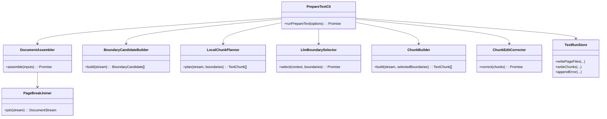
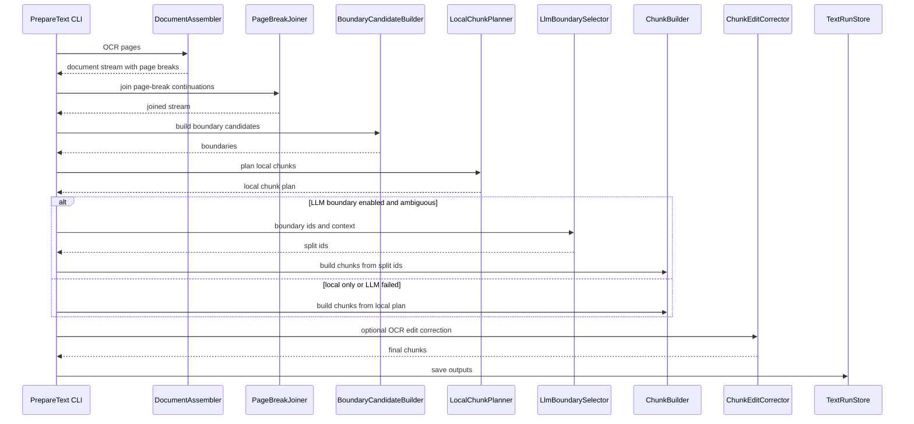
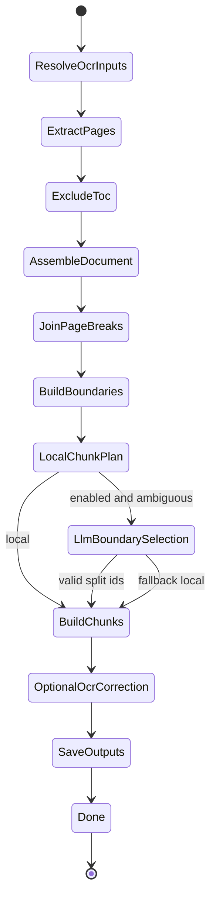

# TTS Boundary Planning MVP

## 1. 概要と目的 Overview and Purpose

- What  
  OCR結果をTTSに渡しやすい自然な文章単位へ分割するため、`prepare-text` の中心処理を「OCR誤字補正」から「文書全体の連結、境界候補生成、TTS向けchunk設計」へ変更する。
- Why  
  現在のchunk生成はページ単位の文字列から直接分割しているため、改ページで文が途切れるケースや、単純な文字数上限による不自然な分割に弱い。TTSでは長すぎる入力を避けつつ、文意や読み上げの息継ぎに合う位置で分割する必要がある。
- How  
  OCRページを文書ストリームとして連結し、page breakを内部境界として保持する。ローカルルールで文末・段落・読点・page break周辺の境界候補を作り、まず決定的なルールでchunk案を作る。判断が難しい箇所だけLLMに境界ID選択を依頼し、本文自体はアプリ側で保持した文字列から生成する。OCR補正は最後の任意処理としてchunk単位で控えめに行う。

## 2. 仕様と受け入れ条件 Specification and Acceptance Criteria

### 2.1 スコープ Scope

- 今回やること
  - OCR run の複数ページを1本の document stream として連結する
  - page breakを内部マーカーとして保持する
  - 目次ページを `--exclude-toc` でdocument streamから除外する
  - 改ページで文の途中になっている場合は自然に連結する
  - 文末、閉じ括弧、段落、読点、page break周辺から boundary candidate を生成する
  - TTS上限文字数に収まるように自然な境界でchunkを作る
  - 長すぎる文だけは読点など次善境界で分割する
  - LLMには本文生成をさせず、split boundary IDだけを返させる
  - LLM失敗時はローカルchunk plannerの結果へフォールバックする
  - OCR補正は分割後chunkに対する任意の後処理として維持する
  - `chunks.json` に document-level chunk を保存する
  - `text-run.json` に分割方式、page break結合、LLM境界選択のmetadataを保存する
- 今回やらないこと
  - 音声生成
  - 字幕、タイムスタンプ生成
  - 高度な意味理解による本文改稿
  - LLMによる本文全文生成
  - ページをまたぐ欠落本文の推測補完

### 2.2 非スコープ Non Scope

- Irodori-TTS API呼び出し
- 音声ファイル生成
- 朗読スピードや声色調整
- 画像前処理
- OCRエンジン変更
- 本文の要約、翻訳、加筆
- LLMによる全文再構成

### 2.3 ユースケース Use Cases

- 正常系: ページをまたいだ本文を自然にchunk化する
  1. ユーザーが `pnpm prepare-text --ocr-run-id 20260522-012612 --pages 2-4 --exclude-toc` を実行する
  2. CLI が page 4 を目次として除外する
  3. CLI が page 2 と page 3 を document stream に連結する
  4. page 2末尾と page 3冒頭が文の途中なら連結する
  5. CLI が自然な文末境界でTTS chunkを保存する

- 正常系: LLMに境界判断だけ依頼する
  1. ローカルchunk plannerが複数の候補境界で迷う
  2. CLI が境界候補IDと短い周辺文脈だけLM Studioへ送る
  3. LM Studio が `<split id="b0007"/>` のような境界IDだけ返す
  4. CLI が該当IDでchunkを確定する

- 異常系: LLMが本文を返してしまう
  1. LMが境界IDではなく本文や説明を返す
  2. CLI が `LLM_RESPONSE_INVALID` を記録する
  3. ローカルchunk planner結果を採用する

- 異常系: 1文がTTS上限を超える
  1. 文末境界だけでは `TEXT_CHUNK_MAX_CHARS` を超える
  2. CLI が読点、括弧、接続詞周辺などの次善境界で分割する
  3. それでも長い場合は安全なhard splitへfallbackする

### 2.4 受け入れ条件 Acceptance Criteria

- Given page 2末尾が `県大` で page 3冒頭が `会で優勝` When `prepare-text` を実行する Then chunk内では `県大会で優勝` として連結される
- Given `--exclude-toc` が指定され page 4 が目次 When `prepare-text` を実行する Then page 4 のchunkは `chunks.json` に含まれない
- Given chunk候補が `TEXT_CHUNK_MAX_CHARS` を超える When chunk生成する Then 文末または次善境界で上限以下に分割される
- Given LLMが利用可能 When 境界選択が必要 Then LLMには本文ではなくboundary ID選択だけを要求する
- Given LLMが不正レスポンスを返す When parseする Then `LLM_RESPONSE_INVALID` を記録しローカルchunk plannerを採用する
- Given OCR補正が有効 When chunk生成後に補正する Then 補正はchunk単位でedit候補方式に限定される
- Given ログ出力 When 実行する Then OCR本文、chunk本文全文、補正本文全文はログに出さない
- Given `chunks.json` When 出力確認する Then page/chunk順序が文書順に保たれている

### 2.5 既知の制約 Known Limitations

- ページをまたぐ欠落文字は推測しない
- 文途中かどうかは句読点、括弧、文字種、次ページ冒頭の形から推定する
- LLM境界選択は補助であり、本文の生成権限は持たない
- 読点での分割はTTSの自然さに影響するため、実データで調整が必要
- 縦書きOCR由来の誤字補正は後段のedit候補方式に委ねる

## 3. 前提技術スタック Context and Tech Stack

- Language Framework  
  TypeScript / Node.js / CLI application
- Libraries  
  commander、dotenv、zod、pino、Node.js fetch、fs/path、Vitest
- Runtime  
  Windows / PowerShell / LM Studio OpenAI-compatible API
- Existing Components
  - `OcrTextInputResolver`
  - `OcrTextExtractor`
  - `LocalTextNormalizer`
  - `TextChunker`
  - `LmStudioEditClient`
  - `ChunkEditValidator`
  - `ChunkEditApplicator`
  - `TextRunStore`
  - `tocDetector`

## 4. インターフェース契約 Interface Contracts

### 4.1 CLI

既存CLIを維持する。

```bash
pnpm prepare-text --ocr-run-id <run-id>
pnpm prepare-text --ocr-run-id <run-id> --pages 2-4
pnpm prepare-text --ocr-run-id <run-id> --pages 2-4 --exclude-toc
pnpm prepare-text --ocr-json <path>
```

追加候補:

```bash
pnpm prepare-text --ocr-run-id <run-id> --split-mode local
pnpm prepare-text --ocr-run-id <run-id> --split-mode llm
pnpm prepare-text --ocr-run-id <run-id> --no-ocr-correction
```

MVPでは `split-mode` はenv設定でもよい。

### 4.2 Env

```env
TEXT_CHUNK_MAX_CHARS=240
TEXT_CHUNK_MIN_CHARS=40
TEXT_SPLIT_MODE=local
TEXT_ENABLE_LLM_BOUNDARY=false
TEXT_PAGE_BREAK_JOIN=true
LLM_ENABLED=true
LLM_MAX_TOKENS=5000
```

方針:

- MVPでは `TEXT_SPLIT_MODE=local` をデフォルトにする
- LLM境界選択は実験機能として `TEXT_ENABLE_LLM_BOUNDARY=true` で有効にする
- OCR補正用LLMと境界選択用LLMの設定は将来分離可能にする

### 4.3 Data Model

Document stream:

```ts
type DocumentSegment = {
  id: string;
  pageIndex: number;
  text: string;
  kind: "text" | "page_break";
};

type DocumentStream = {
  runId: string;
  segments: DocumentSegment[];
  skippedPages: Array<{
    pageIndex: number;
    reason: "TOC" | "EMPTY";
  }>;
};
```

Boundary candidate:

```ts
type BoundaryCandidate = {
  id: string;
  offset: number;
  pageIndex: number;
  kind:
    | "sentence_end"
    | "paragraph"
    | "comma"
    | "page_break"
    | "hard";
  strength: number;
  beforePreview: string;
  afterPreview: string;
};
```

TTS chunk:

```ts
type TextChunk = {
  id: string;
  pageIndex: number;
  order: number;
  text: string;
  charLength: number;
  sourcePageIndexes?: number[];
  boundaryStartId?: string;
  boundaryEndId?: string;
  splitReason?: "local" | "llm" | "hard";
  correction?: TextChunkCorrection;
};
```

LLM boundary request:

```text
<context>
...短い周辺文脈...
</context>

<boundaries>
<b id="b0001">sentence_end</b>
<b id="b0002">comma</b>
<b id="b0003">page_break</b>
</boundaries>

Return only split tags:
<split id="b0001"/>
```

LLM boundary response:

```xml
<split id="b0001"/>
<split id="b0004"/>
```

### 4.4 Error Handling

追加/利用するエラー:

- `LLM_RESPONSE_INVALID`: split id以外を返した、存在しないboundary idを返した
- `BOUNDARY_SELECTION_FAILED`: 境界選択で上限内chunkを作れなかった
- `DOCUMENT_ASSEMBLY_FAILED`: document stream生成に失敗した
- `EMPTY_TEXT_INPUT`: OCR本文が空

方針:

- LLM境界選択失敗時はローカル境界選択へfallback
- ローカル境界選択でも上限を守れない場合はhard split
- hard splitはmetadataに明示する

## 5. アーキテクチャと設計図 Architecture and Diagrams

### 5.1 クラス図 Class Diagram



### 5.2 シーケンス図 Sequence Diagram



### 5.3 状態遷移 State Diagram



## 6. テスト戦略 Test Strategy

### 6.1 Unit Tests

- `DocumentAssembler`
  - 複数ページをdocument streamへ連結する
  - page indexを保持する
  - `--exclude-toc` ページをskippedPagesへ入れる
- `PageBreakJoiner`
  - `県大` + page break + `会で優勝` を `県大会で優勝` にする
  - 句点終わりのpage breakは境界として残す
  - 見出しや章タイトル前のpage breakは結合しない
- `BoundaryCandidateBuilder`
  - 句点、疑問符、感嘆符、閉じ括弧で `sentence_end`
  - 空行/段落で `paragraph`
  - 読点で `comma`
  - page break周辺で `page_break`
- `LocalChunkPlanner`
  - 最大文字数内なら文末境界を優先する
  - 文が長すぎる場合は読点境界を使う
  - それでも長い場合はhard splitする
- `LlmBoundarySelector`
  - `<split id="..."/>` をparseする
  - 存在しないboundary idをrejectする
  - 本文や説明が混ざるレスポンスをrejectする
- `ChunkBuilder`
  - selected boundary idsからchunkを生成する
  - sourcePageIndexesを保持する
  - boundary metadataを保存する

### 6.2 Integration Tests

- `prepare-text --ocr-run-id run --pages 2-4 --exclude-toc`
  - page 4 がskipされる
  - page 2/3がdocument順にchunk化される
  - chunksが最大文字数以下になる
- page break continuation fixture
  - page 1末尾 `県大`
  - page 2冒頭 `会で優勝`
  - output chunkが `県大会で優勝` を含む
- fake LM boundary selector
  - split idだけ返す
  - selected boundaryでchunk化される
- fake invalid LLM
  - local chunk planへfallbackする

### 6.3 Regression Tests

- `以下略`、`省略`、`要約` をLLMが返しても本文に混入しない
- 目次ページが `chunks.json` から除外される
- 文字数上限を超えるchunkが出ない
- page breakで文途中の不自然な分割が出ない
- OCR補正が失敗してもchunk分割結果は保存される

## 7. 実装タスクリスト Implementation Plan

### Phase 1 設計固定と型追加

- [x] 既存 `prepare-text` の入出力fixtureを保存して現状を固定
- [x] `DocumentStream`, `DocumentSegment`, `BoundaryCandidate` 型を追加
- [x] `TextChunk` に `sourcePageIndexes`, `boundaryStartId`, `boundaryEndId`, `splitReason` を追加
- [x] `.env.example` に `TEXT_SPLIT_MODE`, `TEXT_ENABLE_LLM_BOUNDARY`, `TEXT_PAGE_BREAK_JOIN`, `LLM_MAX_TOKENS` を追加
- [x] README に新しい分割方針を追記

### Phase 2 Document assembly

- [x] Test `DocumentAssembler` が複数ページを順番に連結する
- [x] Impl `DocumentAssembler`
- [x] Test `--exclude-toc` が skippedPages を生成する
- [x] Impl `tocDetector` との統合
- [x] Test page index metadata が保持される

### Phase 3 Page break join

- [x] Test 文途中page breakを結合する
- [x] Impl `PageBreakJoiner`
- [x] Test 句点終わりpage breakは文境界として残す
- [x] Test 見出し/章タイトル前は結合しない
- [x] Test join結果に page break metadata を残す

### Phase 4 Boundary candidates

- [x] Test sentence end boundary候補を作る
- [x] Test paragraph boundary候補を作る
- [x] Test comma boundary候補を作る
- [x] Test page break boundary候補を作る
- [x] Impl `BoundaryCandidateBuilder`
- [x] Boundary strength scoringを実装

### Phase 5 Local chunk planner

- [x] Test 文末境界優先でchunk化する
- [x] Test `TEXT_CHUNK_MAX_CHARS` を必ず守る
- [x] Test 長文は読点境界で分割する
- [x] Test 最後の手段としてhard splitする
- [x] Impl `LocalChunkPlanner`
- [x] `TextChunker` との責務整理または置換

### Phase 6 LLM boundary selector optional

- [x] Test `<split id="b0001"/>` parse
- [x] Test 複数split parse
- [x] Test 存在しないboundary idをreject
- [x] Test 本文/説明混入をinvalidにする
- [x] Impl `LlmBoundarySelector`
- [x] `LLM_MAX_TOKENS` を config化
- [x] LLM失敗時local planner fallbackを実装

### Phase 7 Chunk builder and OCR correction integration

- [x] Test selected boundaryからchunkを生成する
- [x] Impl `ChunkBuilder`
- [x] Test sourcePageIndexes metadata
- [x] 既存 `ChunkEditCorrector` 相当をchunk後処理として分離
- [x] `--no-ocr-correction` またはenvでOCR補正無効化を可能にする
- [x] OCR補正失敗時もchunk本文は保存する

### Phase 8 prepare-text flow差し替え

- [x] Test 新flowの統合テストを作成
- [x] Impl `prepare-text` を document-level flow に差し替える
- [x] Test `--exclude-toc` with document-level flow
- [x] Test `--ocr-json` single page flow
- [x] Test LM boundary disabled default
- [x] Test LM boundary enabled fallback

### Phase 9 実データ検証

- [x] `pnpm prepare-text --ocr-run-id 20260522-012612 --pages 2-4 --exclude-toc` を実行
- [x] page 2末尾/page 3冒頭の文が自然につながることを確認
- [x] page 4 が `skipReason: "TOC"` で除外されることを確認
- [x] `chunks.json` の全chunkが最大文字数以下であることを確認
- [ ] TTSで読み上げたときに不自然な途中切れが減ることを確認

### Phase 10 仕上げ

- [x] `pnpm test`
- [x] `pnpm typecheck`
- [x] README更新
- [x] 計画書のチェック更新
- [x] 既知の制約と次フェーズ課題を整理

## 8. 完了の定義 Definition of Done

### 8.1 Functional DoD

- [x] `prepare-text` が document-level chunking を使う
- [x] 改ページで途切れた文を自然に結合できる
- [x] 目次ページを除外できる
- [x] 全chunkが `TEXT_CHUNK_MAX_CHARS` 以下になる
- [x] LLMは本文を生成せず、境界ID選択だけに使われる
- [x] LLMなしでも自然なlocal chunkが生成される
- [x] OCR補正はchunk生成後の任意後処理になっている

### 8.2 Quality DoD

- [x] 全テストがパスしている
- [x] TypeScript typecheck がパスしている
- [x] 本文全文をログに出していない
- [x] 実データで page break の文途中分割が改善している
- [x] 実データで目次ページが除外されている
- [x] README と計画書が更新されている

## 9. 懸念事項と未確定事項 Concerns and Questions

- TTSの最適chunk長を何文字にするか
- 読点分割をどの程度許容するか
- page break結合の誤結合をどう検出するか
- LLM boundary selectionを初期MVPで有効にするか、まずlocalのみで完成させるか
- OCR補正と自然分割の順序を最終的にどうするか
- `google/gemma-4-26b-a4b` のようなreasoning-heavy modelでは `LLM_MAX_TOKENS` が大きく必要になるため、境界選択LLMには別モデルを使うか
- 候補抽出型OCR補正へ移行する場合、candidate抽出器を別フェーズで設計する必要がある
