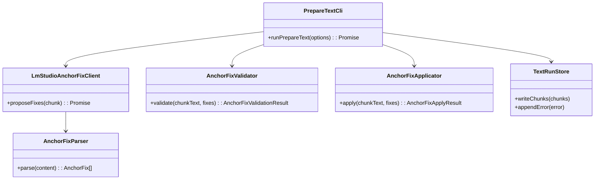
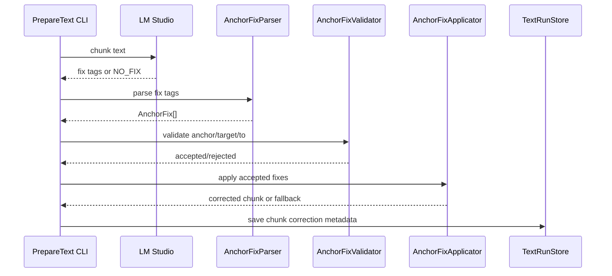
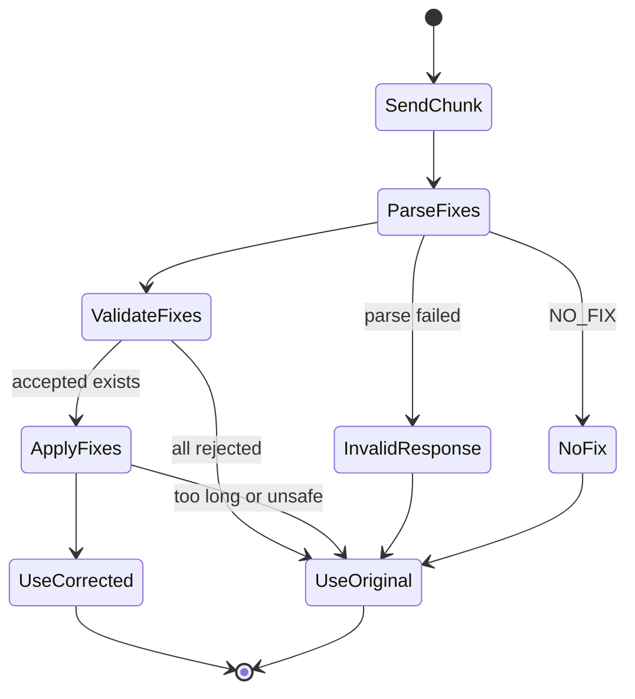

# Anchor Based OCR Fix MVP

## 1. 概要と目的 Overview and Purpose

- What  
  TTS向けに自然分割されたchunkに対して、LLMが疑わしいOCR語を見つけ、`anchor / target / to` 形式の修正候補を返す。アプリ側はanchor内のtargetだけを検証して置換する。
- Why  
  OCR誤り候補をロジックだけで抽出するのは現実的ではない。一方で、LLMに本文全文を再生成させると省略、加筆、推測補完、順序変更が起きる。LLMには候補抽出と置換案だけを任せ、実際の置換範囲はアプリ側で制御する。
- How  
  S04のdocument-level TTS chunk生成後に、各chunkをLLMへ渡す。LLMは `<fix><anchor>...</anchor><target>...</target><to>...</to></fix>` の0個以上、または `NO_FIX` を返す。アプリ側は `anchor` がchunk内に完全一致し、`target` がanchor内に完全一致する場合だけ、該当anchor内のtargetをtoへ置換する。

## 2. 仕様と受け入れ条件 Specification and Acceptance Criteria

### 2.1 スコープ Scope

- 今回やること
  - 既存の `from/to JSON edit` 方式を `anchor/target/to XML-like fix` 方式へ置き換える
  - LLMに疑わしいOCR語の発見を任せる
  - LLMには本文全文を返させない
  - LLM出力をXMLライクタグとしてparseする
  - `anchor` がchunk内に存在しないfixをrejectする
  - `target` がanchor内に存在しないfixをrejectする
  - anchor内のtargetだけを置換する
  - 入力にない数字、要約、省略、続きを追加するfixをrejectする
  - 変更量が大きすぎるfixをrejectする
  - LLM失敗時は元chunkを使う
  - `chunks.json` に補正metadataを保存する
- 今回やらないこと
  - 候補抽出辞書の大規模整備
  - offset指定方式
  - structured output JSON schema
  - 本文全文生成による校正
  - 音声生成

### 2.2 非スコープ Non Scope

- TTS API呼び出し
- OCR画像前処理
- ページ結合や自然分割の再設計
- 翻訳、要約、文章の言い換え
- LLMによる年齢、年数、固有名詞の推測補完

### 2.3 ユースケース Use Cases

- 正常系: LLMが疑わしいOCR語を見つけて修正する
  1. chunkに `広報担当者から来たメツセ` が含まれる
  2. LLMが `<fix><anchor>広報担当者から来たメツセ</anchor><target>メツセ</target><to>メッセ</to></fix>` を返す
  3. CLIがchunk内のanchorを探す
  4. anchor内のtargetだけをtoへ置換する
  5. `chunks.json` に修正済みchunkとmetadataを保存する

- 正常系: 修正不要
  1. LLMが `NO_FIX` を返す
  2. CLIはchunkを変更しない
  3. metadataに `acceptedFixCount: 0` を記録する

- 異常系: LLMが本文全文を返す
  1. LLMがchunk本文や説明文を返す
  2. parserがinvalidとして扱う
  3. CLIは元chunkを採用する
  4. `LLM_RESPONSE_INVALID` を記録する

- 異常系: anchorが存在しない
  1. LLMが入力chunkに存在しないanchorを返す
  2. validatorが `ANCHOR_NOT_FOUND` でrejectする
  3. そのfixは適用しない

- 異常系: targetがanchor内に存在しない
  1. LLMがanchor内に含まれないtargetを返す
  2. validatorが `TARGET_NOT_FOUND_IN_ANCHOR` でrejectする
  3. そのfixは適用しない

### 2.4 受け入れ条件 Acceptance Criteria

- Given chunk内にanchorが完全一致する When fixを適用する Then anchor内のtargetだけが置換される
- Given chunk内にanchorが存在しない When validationする Then fixはrejectされる
- Given anchor内にtargetが存在しない When validationする Then fixはrejectされる
- Given LLMが `NO_FIX` を返す When parseする Then 空fixとして扱う
- Given LLMが複数 `<fix>` を返す When parseする Then順番通りに検証し安全なfixだけ適用する
- Given LLMが本文全文を返す When parseする Then `LLM_RESPONSE_INVALID` でfallbackする
- Given fixが入力にない数字を追加する When validationする Then rejectされる
- Given fixが `以下略` / `省略` / `要約` を追加する When validationする Then rejectされる
- Given fix適用後にchunk長が上限を超える When applyする Then元chunkへfallbackまたは該当fixをrejectする
- Given ログ出力 When 実行する Then chunk本文全文、anchor全文、to全文をログに出さない

### 2.5 既知の制約 Known Limitations

- LLMがanchorを長く取りすぎる可能性がある
- 同一anchorが複数回出る場合の扱いが必要
- 複数fixの適用順によって後続anchorがずれる可能性がある
- XMLライクparseは厳密XML parserではなく、制限付きタグ抽出から開始する
- reasoning-heavyモデルでは `LLM_MAX_TOKENS` を大きくしないとcontentに到達しない場合がある

## 3. 前提技術スタック Context and Tech Stack

- Language Framework  
  TypeScript / Node.js / CLI application
- Libraries  
  commander、dotenv、zod、pino、Node.js fetch、fs/path、Vitest
- Runtime  
  LM Studio OpenAI-compatible API
- Existing Components
  - `prepare-text`
  - `TextChunk`
  - `TextRunStore`
  - `LocalChunkPlanner` / `TextChunker`
  - `ChunkEditValidator`
  - `ChunkEditApplicator`
  - `LmStudioEditClient`

## 4. インターフェース契約 Interface Contracts

### 4.1 CLI

既存CLIを維持する。

```bash
pnpm prepare-text --ocr-run-id <run-id>
pnpm prepare-text --ocr-run-id <run-id> --pages 2-4 --exclude-toc
pnpm prepare-text --ocr-json <path>
```

追加候補:

```bash
pnpm prepare-text --no-ocr-correction
pnpm prepare-text --ocr-fix-mode anchor
```

MVPでは env の `LLM_CORRECTION_MODE=anchor` で切り替えてもよい。

### 4.2 Env

```env
LLM_ENABLED=true
LLM_CORRECTION_MODE=anchor
LLM_MAX_TOKENS=10000
LLM_MAX_FIXES_PER_CHUNK=5
LLM_MAX_ANCHOR_CHARS=40
LLM_MAX_FIX_RATIO=0.25
```

方針:

- `LLM_CORRECTION_MODE=anchor` を新方式にする
- `LLM_MAX_TOKENS` は reasoning-heavy model を考慮して設定可能にする
- 1chunkあたりのfix数を制限する
- anchorが長すぎる場合はrejectする

### 4.3 LLM Prompt Contract

System prompt:

```text
あなたはOCR誤りの修正候補を探すエンジンです。
本文全文を返してはいけません。
修正候補だけを返してください。
修正不要なら NO_FIX のみ返してください。

出力形式:
<fix><anchor>置換箇所を含む短い原文</anchor><target>置換対象</target><to>置換後</to></fix>

ルール:
- <anchor> は入力chunk内に完全一致する短い文字列
- <target> は <anchor> の中に完全一致する文字列
- <to> は置換後の文字列
- 推測で数字、固有名詞、続きを補わない
- 要約、省略、本文全文は禁止
- Markdown、JSON、説明文は禁止
```

User prompt:

```text
<chunk id="p000002-c001">
私のスマホに通知された、広報担当者から来たメツセ...
</chunk>

Output examples:
<fix><anchor>広報担当者から来たメツセ</anchor><target>メツセ</target><to>メッセ</to></fix>
NO_FIX
```

Expected output:

```xml
<fix><anchor>広報担当者から来たメツセ</anchor><target>メツセ</target><to>メッセ</to></fix>
```

### 4.4 Data Model

```ts
type AnchorFix = {
  anchor: string;
  target: string;
  to: string;
};

type AnchorFixRejectCode =
  | "ANCHOR_NOT_FOUND"
  | "ANCHOR_NOT_UNIQUE"
  | "ANCHOR_TOO_LONG"
  | "EMPTY_ANCHOR"
  | "EMPTY_TARGET"
  | "EMPTY_TO"
  | "TARGET_NOT_FOUND_IN_ANCHOR"
  | "ADDS_UNSEEN_NUMBER"
  | "ADDS_OMISSION_MARKER"
  | "TOO_MUCH_CHANGE"
  | "TOO_MANY_FIXES"
  | "TOO_LONG_AFTER_FIX";

type AnchorFixValidationResult = {
  accepted: AnchorFix[];
  rejected: Array<{
    fix: AnchorFix;
    code: AnchorFixRejectCode;
    message: string;
  }>;
};
```

`TextChunkCorrection` 拡張案:

```ts
type TextChunkCorrection = {
  usedLlm: boolean;
  acceptedEditCount: number;
  rejectedEditCount: number;
  fallbackReason?: TextPrepErrorCode;
  rejectReasons?: Array<ChunkEditRejectCode | AnchorFixRejectCode>;
  mode?: "anchor";
};
```

### 4.5 Error Handling

- `LLM_REQUEST_FAILED`: HTTP失敗、timeout、非2xx
- `LLM_RESPONSE_INVALID`: XMLライクタグparse失敗、本文全文、説明混入
- `LLM_EDIT_REJECTED`: fix候補がvalidationでrejectされた
- chunk単位で失敗してもrun全体は継続
- LLM失敗時は元chunkを採用

## 5. アーキテクチャと設計図 Architecture and Diagrams

### 5.1 クラス図 Class Diagram



### 5.2 シーケンス図 Sequence Diagram



### 5.3 状態遷移 State Diagram



## 6. テスト戦略 Test Strategy

### 6.1 Unit Tests

- `AnchorFixParser`
  - `NO_FIX` を空配列としてparseする
  - 単一 `<fix>` をparseする
  - 複数 `<fix>` をparseする
  - Markdown fenceや説明混入をinvalidにする
  - `<anchor>` / `<target>` / `<to>` 欠落をinvalidにする
- `AnchorFixValidator`
  - anchorがchunk内に存在するfixをacceptする
  - anchorが存在しないfixをrejectする
  - anchorが複数回出るfixをrejectする
  - targetがanchor内に存在しないfixをrejectする
  - anchorが長すぎるfixをrejectする
  - 入力にない数字追加をrejectする
  - 省略マーカー追加をrejectする
  - 変更量が大きすぎるfixをrejectする
- `AnchorFixApplicator`
  - anchor内targetだけを置換する
  - anchor外の同一targetは置換しない
  - 複数fixを順番に適用する
  - 適用後上限超過でfallbackする
- `LmStudioAnchorFixClient`
  - promptがanchor形式になっている
  - `max_tokens` がconfigから入る
  - fake responseをparseできる

### 6.2 Integration Tests

- fake LMで `<fix><anchor>...` を返し、`chunks.json` に反映される
- fake LMで `NO_FIX` を返し、chunkが変わらない
- fake LMで危険fixを返し、reject metadataが保存される
- fake LMで本文全文を返し、chunkがfallbackする
- `prepare-text --exclude-toc` と併用できる

### 6.3 Regression Tests

- `メツセ -> メッセ` が通る
- `メツセ -> メッセージ` のような過補完をrejectするか方針を固定する
- `以年 -> 今年も` で `今年もも` が発生するfixをrejectする
- `以下略` / `省略` / `要約` が混入しない
- page 4目次は除外される

## 7. 実装タスクリスト Implementation Plan

### Phase 1 型と設定

- [x] `AnchorFix`, `AnchorFixRejectCode`, `AnchorFixValidationResult` 型を追加
- [x] `TextChunkCorrection.mode` を追加
- [x] `TextPrepConfig` に `llmMaxTokens`, `llmMaxFixesPerChunk`, `llmMaxAnchorChars` を追加
- [x] `.env.example` と README に anchor fix 設定を追加

### Phase 2 Parser

- [x] Test `NO_FIX` parse
- [x] Test 単一fix parse
- [x] Test 複数fix parse
- [x] Test 欠落タグinvalid
- [x] Impl `AnchorFixParser`
- [x] Markdown/説明混入rejectを実装

### Phase 3 Validator

- [x] Test anchor exists
- [x] Test anchor not found
- [x] Test anchor not unique
- [x] Test target not found in anchor
- [x] Test anchor too long
- [x] Test unseen number reject
- [x] Test omission marker reject
- [x] Test too much change reject
- [x] Impl `AnchorFixValidator`

### Phase 4 Applicator

- [x] Test anchor内targetだけ置換
- [x] Test anchor外targetは置換しない
- [x] Test 複数fix適用
- [x] Test 上限超過fallback
- [x] Impl `AnchorFixApplicator`

### Phase 5 LM Client

- [x] Test prompt contract
- [x] Test fake LM response
- [x] Impl `LmStudioAnchorFixClient`
- [x] `LLM_MAX_TOKENS` を利用する
- [x] 既存 `LmStudioEditClient` との切り替え方針を決める

### Phase 6 prepare-text統合

- [x] Test anchor fix flow integration
- [x] Impl chunk後OCR補正をanchor方式へ切り替え
- [x] Test `NO_FIX` flow
- [x] Test dangerous fix reject metadata
- [x] Test `--exclude-toc` 併用
- [x] 旧JSON from/to方式を削除またはfallback化

### Phase 7 実データ検証

- [ ] `pnpm prepare-text --ocr-run-id 20260522-012612 --pages 2-4 --exclude-toc` 実行
- [ ] `メツセ`, `フエイスブツク`, `ネツト`, `プログ`, `サツカー`, `トツプ` の補正傾向を確認
- [ ] `今年もも`, `以下略`, `省略`, `要約` が混入しないことを確認
- [ ] page 4 がTOC除外されることを確認
- [ ] fallback/reject metadataを確認

検証メモ:

- 2026-05-24: `pages 2-4 --exclude-toc` は LM Studio 応答待ちで10分timeout。page 4 はTOCとしてskipされるところまでは確認。
- 2026-05-24: `LLM_MODEL=google/gemma-4-26b-a4b`, `LLM_MAX_TOKENS=512`, `pages 2` は完走。ただし多くのchunkで `message.content` が空のため `LLM_RESPONSE_INVALID` fallback。reasoning-heavyモデル向けに、次フェーズでプロンプト短縮、非reasoningモデル比較、または小さいmax chunkで再検証が必要。

### Phase 8 仕上げ

- [x] `pnpm test`
- [x] `pnpm typecheck`
- [x] README更新
- [x] 計画書チェック更新
- [x] 次フェーズ課題を整理

## 8. 完了の定義 Definition of Done

### 8.1 Functional DoD

- [x] LLMがanchor/target/to形式のfixを返せる
- [x] アプリ側がanchor内targetだけを置換できる
- [x] LLMが候補抽出を担当し、本文全文は採用しない
- [x] 危険fixはrejectされる
- [x] LLM失敗時も元chunkが保存される
- [x] `--exclude-toc` と併用できる

### 8.2 Quality DoD

- [x] 全テストがパスしている
- [x] TypeScript typecheck がパスしている
- [x] 本文全文をログ出力しない
- [ ] 実データで過補完や省略が混入しない
- [ ] 実データで少なくとも代表的OCR誤りが安全に補正できる
- [x] READMEと計画書が更新されている

## 9. 懸念事項と未確定事項 Concerns and Questions

- `メツセ -> メッセ` は許可するが `メツセ -> メッセージ` をrejectするか
- anchorが長すぎる場合の閾値
- 同じanchorが複数ある場合にrejectするか、位置指定へ拡張するか
- XMLライクタグparseをどこまで厳格にするか
- reasoning-heavyモデルで `LLM_MAX_TOKENS=10000` でもcontentに到達しない場合の速度
- LLM境界選択とOCR fixを同じモデルで行うか、別モデルに分けるか
