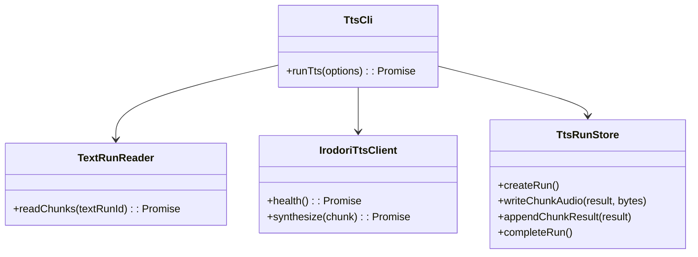
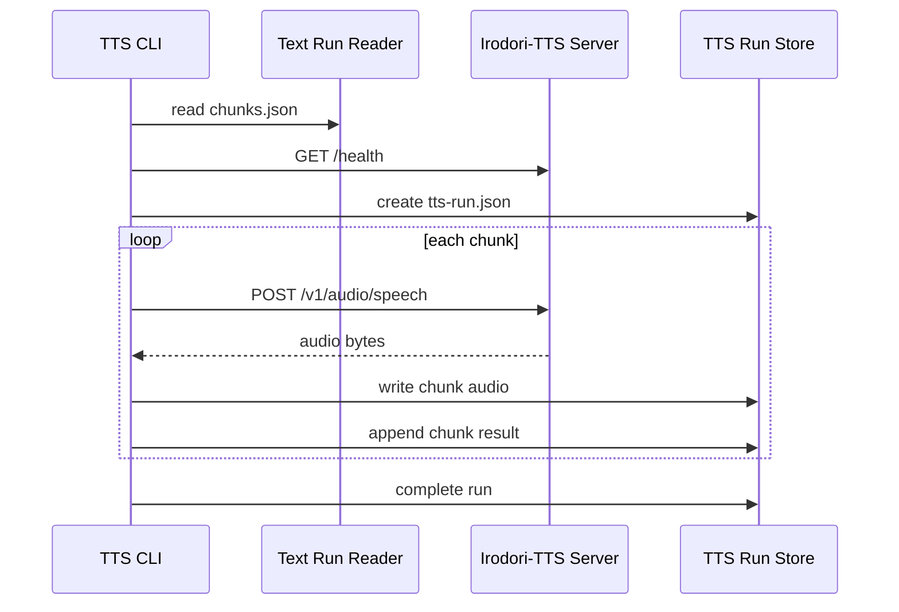
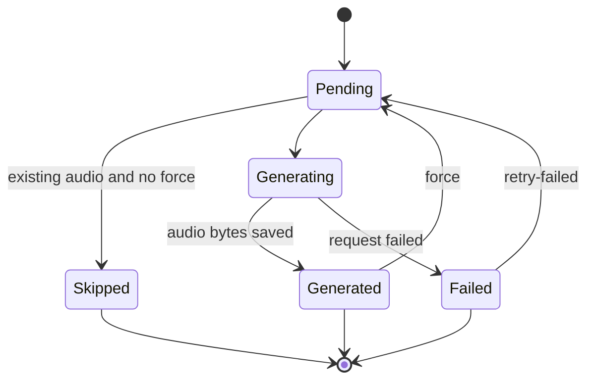

# Irodori TTS Audio Generation MVP

## 1. 概要と目的 Overview and Purpose

- What  
  `prepare-text` が生成した `data/text/<run-id>/chunks.json` を入力にし、Irodori-TTS でchunkごとの音声ファイルを生成する。
- Why  
  PageCaster の最終目的はKindle本文を音声として聴ける状態にすること。OCR、本文補正、TTS向け自然分割まではできているため、次は各chunkを安全に音声化し、失敗しても再実行できる単位で保存する。
- How  
  MVPでは Irodori-TTS-Server の OpenAI互換 `POST /v1/audio/speech` を利用する。実行環境はAMD GPUを想定し、Irodori-TTS本体はROCm対応の依存関係で動かす。各 `TextChunk` を1件ずつ逐次送信し、`data/tts/<text-run-id>/chunks/<chunk-id>.<format>` に保存する。結果とエラーは `data/tts/<text-run-id>/tts-run.json` に記録する。

References:

- Irodori-TTS official repository: https://github.com/Aratako/Irodori-TTS
- Irodori-TTS-Server official repository: https://github.com/Aratako/Irodori-TTS-Server

## 2. 仕様と受け入れ条件 Specification and Acceptance Criteria

### 2.1 スコープ Scope

- 今回やること
  - `pnpm tts --text-run-id <run-id>` CLIを追加する
  - `data/text/<run-id>/chunks.json` を読み込む
  - Irodori-TTS-Server の `/v1/audio/speech` へchunk本文を送る
  - chunkごとの音声ファイルを保存する
  - `tts-run.json` に生成状況、elapsedMs、HTTP status、byteLength、sha256、エラーを保存する
  - 既に音声ファイルがあるchunkはデフォルトでskipする
  - `--force` で既存音声を再生成する
  - `--chunks <filter>` でchunk IDまたは範囲を限定できる
  - `--retry-failed` で前回失敗chunkだけ再実行できる
  - Irodori-TTS接続確認用に `/health` または `/v1/models` を確認する
  - AMD ROCm/WSL前提の起動手順と動作確認をREADMEに記載する
- 今回やらないこと
  - 全chunkの結合済み単一音声ファイル生成
  - 音量正規化、無音挿入、章単位m4b化
  - ストリーミング再生
  - Irodori-TTS本体やサーバーの自動インストール
  - reference voice の自動アップロード
  - 複数chunkの並列生成

### 2.2 非スコープ Non Scope

- Kindle capture / OCR / prepare-text の再設計
- TTS向けchunk境界の追加最適化
- 音声品質の自動評価
- GPU使用状況監視
- プレイヤーUI

### 2.3 ユースケース Use Cases

- 正常系: text run 全体を音声化
  1. `data/text/20260522-012612/chunks.json` が存在する
  2. `pnpm tts --text-run-id 20260522-012612` を実行する
  3. CLI がchunkを文書順に読み込む
  4. 各chunkをIrodori-TTSへ送る
  5. `data/tts/20260522-012612/chunks/p000002-c001.wav` などが保存される
  6. `data/tts/20260522-012612/tts-run.json` に結果が保存される

- 正常系: 既存音声をskip
  1. すでに `p000002-c001.wav` が存在する
  2. `--force` なしで実行する
  3. CLI はそのchunkをskipし、metadataに `status: "skipped"` を記録する

- 正常系: 失敗chunkだけ再実行
  1. 前回 `p000002-c003` が失敗している
  2. `pnpm tts --text-run-id 20260522-012612 --retry-failed` を実行する
  3. CLI は失敗chunkだけTTSへ送る
  4. 成功したらmetadataを更新する

- 異常系: Irodori-TTSが起動していない
  1. `/health` または `/v1/models` が失敗する
  2. CLI は `TTS_SERVER_UNAVAILABLE` を記録して終了する
  3. 既存の音声ファイルは削除しない

- 異常系: 1chunkの音声生成が失敗
  1. `POST /v1/audio/speech` が非2xxまたはtimeoutする
  2. CLI はそのchunkを `failed` として記録する
  3. 後続chunkは継続する

### 2.4 受け入れ条件 Acceptance Criteria

- Given `chunks.json` が存在する When `pnpm tts --text-run-id <run-id>` を実行する Then chunkごとの音声ファイルと `tts-run.json` が生成される
- Given Irodori-TTS serverが起動していない When 実行する Then `TTS_SERVER_UNAVAILABLE` で分かる
- Given chunk生成に失敗する When 実行する Then run全体は継続し、失敗chunkがmetadataに残る
- Given 既存音声ファイルがある When `--force` なし Then そのchunkはskipされる
- Given `--force` あり When 既存音声ファイルがある Then 再生成される
- Given `--chunks p000002-c001,p000002-c003` When 実行する Then 指定chunkだけ生成される
- Given `--retry-failed` When 前回失敗chunkがある Then 失敗chunkだけ再生成される
- Given audio responseが空 When 保存する Then `EMPTY_TTS_AUDIO` として失敗扱いにする
- Given ログ出力 When 実行する Then chunk本文全文はログに出さない

### 2.5 既知の制約 Known Limitations

- Irodori-TTS-Serverはデフォルトで同時合成数1のキュー前提なので、MVPは逐次処理にする
- AMD ROCmは主にLinux/WSL前提。PageCaster本体がWindows側で動く場合、Irodori-TTS-ServerはWSL側で起動しHTTP越しに接続する
- Irodori-TTS-Server公式DockerがNVIDIA GPU中心の場合、AMD環境ではDockerではなくROCm対応Python環境での起動を優先する
- Irodori-TTS側にも長文chunking機能があるが、PageCaster側で既にTTS向けchunk化済みのため、MVPでは1chunkずつ送る
- 音声品質はreference voice、num_steps、cfg_scale、speedに強く依存する
- wav以外のformatはFFmpeg依存になる場合がある

## 3. 前提技術スタック Context and Tech Stack

- Language Framework  
  TypeScript / Node.js / CLI application
- Libraries  
  commander、dotenv、zod、pino、Node.js fetch、fs/path、crypto、Vitest
- Runtime  
  Irodori-TTS-Server OpenAI-compatible API
- GPU Runtime  
  AMD ROCm on Linux/WSL。WindowsネイティブでROCmが使えない場合はWSL上でIrodori-TTS/Irodori-TTS-Serverを起動し、PageCasterから `http://127.0.0.1:8088` またはWSLの到達可能なURLへ接続する。
- Existing Components
  - `prepare-text`
  - `TextChunk`
  - `TextRunStore`
  - `data/text/<run-id>/chunks.json`
  - `data/text/<run-id>/text-run.json`

## 4. インターフェース契約 Interface Contracts

### 4.1 CLI

```bash
pnpm tts --text-run-id <run-id>
pnpm tts --text-run-id <run-id> --chunks p000002-c001,p000002-c003
pnpm tts --text-run-id <run-id> --chunks 1-3
pnpm tts --text-run-id <run-id> --retry-failed
pnpm tts --text-run-id <run-id> --force
```

MVP CLI options:

```ts
type TtsCliOptions = {
  textRunId: string;
  chunks?: string;
  retryFailed?: boolean;
  force?: boolean;
};
```

### 4.2 Env

```env
TTS_PROVIDER=irodori
IRODORI_TTS_BASE_URL=http://127.0.0.1:8088/v1
IRODORI_TTS_HEALTH_URL=http://127.0.0.1:8088/health
IRODORI_TTS_MODEL=irodori-tts
IRODORI_TTS_VOICE=sample
IRODORI_TTS_RESPONSE_FORMAT=wav
IRODORI_TTS_TIMEOUT_MS=1200000
IRODORI_TTS_SPEED=1.0
IRODORI_TTS_NUM_STEPS=24
IRODORI_TTS_CFG_SCALE_TEXT=3.0
IRODORI_TTS_CFG_SCALE_SPEAKER=5.0
IRODORI_TTS_CHUNKING_ENABLED=false
```

Notes:

- `IRODORI_TTS_CHUNKING_ENABLED=false` を初期値にし、PageCaster側chunk単位を尊重する
- `voice` はIrodori-TTS-Server側の `voices/` に置いた参照音声のstem、または `none`
- `response_format` はMVPでは `wav` を推奨
- AMD ROCm環境ではIrodori-TTS側を `uv sync --extra rocm` で構築する。Irodori-TTS-ServerがROCm Dockerをまだ前提化していない場合は、サーバーをWSL/Linux上のPython環境で起動する方針にする。

### 4.3 AMD ROCm Setup Assumption

Irodori-TTS本体のROCm依存関係を使う想定:

```bash
git clone https://github.com/Aratako/Irodori-TTS.git
cd Irodori-TTS
uv sync --extra rocm
```

Irodori-TTS-Serverを使う場合:

```bash
git clone https://github.com/Aratako/Irodori-TTS-Server.git
cd Irodori-TTS-Server
uv sync
uv run python -m irodori_openai_tts --host 0.0.0.0 --port 8088
```

ROCm確認:

```bash
rocminfo
python - <<'PY'
import torch
print(torch.cuda.is_available())
print(torch.version.hip)
PY
```

PageCaster側から確認:

```powershell
Invoke-RestMethod http://127.0.0.1:8088/health
```

### 4.4 API Request

```json
{
  "model": "irodori-tts",
  "input": "chunk text",
  "voice": "sample",
  "response_format": "wav",
  "speed": 1.0,
  "irodori": {
    "num_steps": 24,
    "cfg_scale_text": 3.0,
    "cfg_scale_speaker": 5.0,
    "chunking_enabled": false
  }
}
```

### 4.5 Output Layout

```text
data/
  tts/
    <text-run-id>/
      tts-run.json
      chunks/
        p000002-c001.wav
        p000002-c002.wav
      debug/
        p000002-c001.request.json
        p000002-c001.error.json
```

### 4.6 Data Model

```ts
type TtsConfig = {
  provider: "irodori";
  baseUrl: string;
  healthUrl: string;
  model: string;
  voice: string;
  responseFormat: "wav" | "mp3" | "flac" | "opus" | "aac" | "pcm";
  timeoutMs: number;
  speed: number;
  numSteps: number;
  cfgScaleText: number;
  cfgScaleSpeaker: number;
  chunkingEnabled: boolean;
};

type TtsChunkResult = {
  chunkId: string;
  pageIndex: number;
  order: number;
  textLength: number;
  outputPath?: string;
  responseFormat: string;
  byteLength: number;
  sha256?: string;
  elapsedMs: number;
  status: "generated" | "skipped" | "failed";
  httpStatus?: number;
  errorCode?: TtsErrorCode;
  errorMessage?: string;
  generatedAt: string;
};

type TtsRun = {
  runId: string;
  sourceTextRunId: string;
  provider: "irodori";
  model: string;
  voice: string;
  responseFormat: string;
  startedAt: string;
  completedAt?: string;
  chunks: TtsChunkResult[];
  errors: TtsError[];
};
```

### 4.7 Error Handling

```ts
type TtsErrorCode =
  | "TEXT_RUN_NOT_FOUND"
  | "CHUNKS_NOT_FOUND"
  | "TTS_SERVER_UNAVAILABLE"
  | "TTS_REQUEST_FAILED"
  | "EMPTY_TTS_AUDIO"
  | "AUDIO_WRITE_FAILED"
  | "CONFIG_INVALID";
```

- server connection失敗は `TTS_SERVER_UNAVAILABLE`
- chunkごとの非2xx、timeout、fetch例外は `TTS_REQUEST_FAILED`
- response bodyが0 byteなら `EMPTY_TTS_AUDIO`
- 失敗しても後続chunkは継続

## 5. アーキテクチャと設計図 Architecture and Diagrams

### 5.1 クラス図 Class Diagram



### 5.2 シーケンス図 Sequence Diagram



### 5.3 状態遷移 State Diagram



## 6. テスト戦略 Test Strategy

### 6.1 Unit Tests

- `TtsOptions`
  - `--text-run-id` 必須
  - `--chunks` と `--retry-failed` の扱い
- `TtsChunkSelector`
  - chunk IDリスト指定
  - order範囲指定
  - retry-failed指定
- `IrodoriTtsClient`
  - health endpoint成功
  - `/v1/audio/speech` request body
  - wav bytes保存
  - HTTP 503を `TTS_REQUEST_FAILED` にする
  - timeout/fetch errorを `TTS_REQUEST_FAILED` にする
- `TtsRunStore`
  - audio file保存
  - sha256計算
  - `tts-run.json` 保存
  - 既存audio skip判定

### 6.2 Integration Tests

- fake Irodori serverで2chunkをwav化し、`data/tts/<run-id>/chunks/*.wav` ができる
- fake serverの1chunkだけ500にし、後続chunkが継続する
- `--retry-failed` で失敗chunkだけ再実行する
- `--force` で既存audioを再生成する

### 6.3 Manual Smoke Tests

```powershell
Invoke-RestMethod http://127.0.0.1:8088/health
corepack pnpm tts --text-run-id 20260522-012612 --chunks p000002-c001
```

確認:

- `data/tts/20260522-012612/chunks/p000002-c001.wav` が生成される
- wavが再生できる
- `tts-run.json` に `elapsedMs`, `byteLength`, `sha256` が入る

## 7. 実装タスクリスト Implementation Plan

### Phase 1 型と設定

- [ ] `TtsConfig`, `TtsRun`, `TtsChunkResult`, `TtsError` 型を追加
- [ ] `loadTtsConfig` を追加
- [ ] `.env.example` に Irodori TTS 設定を追加
- [ ] README に AMD ROCm/WSLでの Irodori-TTS-Server 起動前提と `pnpm tts` を追加

### Phase 2 CLI Options

- [ ] `TtsCliOptions` を追加
- [ ] `validateTtsOptions` を追加
- [ ] `program.ts` に `tts` command を追加
- [ ] `program.test.ts` に dispatch test を追加

### Phase 3 Text Run Input

- [ ] `TextRunReader` または `TtsInputResolver` を追加
- [ ] `chunks.json` 読み込みtest
- [ ] chunk ID filter test
- [ ] order range filter test
- [ ] missing text run error test

### Phase 4 Irodori Client

- [ ] `IrodoriTtsClient.health()` test
- [ ] `IrodoriTtsClient.synthesize()` request body test
- [ ] audio bytes response test
- [ ] non-2xx error test
- [ ] timeout/fetch error test
- [ ] Impl `IrodoriTtsClient`

### Phase 5 TTS Run Store

- [ ] audio output path設計
- [ ] wav bytes保存test
- [ ] sha256計算test
- [ ] `tts-run.json` metadata保存test
- [ ] debug request/error保存test
- [ ] Impl `TtsRunStore`

### Phase 6 CLI Integration

- [ ] fake Irodori server integration test
- [ ] Impl `runTts`
- [ ] 既存audio skip test
- [ ] `--force` integration test
- [ ] chunk単位失敗継続test
- [ ] `--retry-failed` test

### Phase 7 実データ検証

- [ ] AMD ROCm環境で `rocminfo` / `torch.version.hip` を確認
- [ ] Irodori-TTS-Server `/health` 確認
- [ ] `pnpm tts --text-run-id 20260522-012612 --chunks p000002-c001` 実行
- [ ] 生成wavを再生確認
- [ ] `tts-run.json` のmetadata確認
- [ ] 2〜3chunk連続生成の速度確認
- [ ] 失敗時 `--retry-failed` 確認

### Phase 8 仕上げ

- [ ] `pnpm test`
- [ ] `pnpm typecheck`
- [ ] README更新
- [ ] 計画書チェック更新
- [ ] 次フェーズ課題を整理

## 8. 完了の定義 Definition of Done

### 8.1 Functional DoD

- [ ] `pnpm tts --text-run-id <run-id>` が実行できる
- [ ] chunkごとの音声ファイルが保存される
- [ ] `tts-run.json` に生成結果が保存される
- [ ] 失敗chunkがあっても後続chunkを継続できる
- [ ] `--retry-failed` で失敗chunkだけ再実行できる
- [ ] `--force` で再生成できる

### 8.2 Quality DoD

- [ ] 全テストがパスしている
- [ ] TypeScript typecheck がパスしている
- [ ] chunk本文全文を通常ログに出さない
- [ ] 既存の capture / ocr / prepare-text を壊していない
- [ ] READMEと計画書が更新されている

## 9. 懸念事項と未確定事項 Concerns and Questions

- Irodori-TTS-Server を前提にするか、Irodori-TTS本体 `infer.py` 直接呼び出しも対応するか
- Irodori-TTS-ServerをAMD ROCmで問題なく起動できるか。難しい場合、MVPは `infer.py` 直接呼び出し backend を先に作るか
- `voice` の初期値を `sample` にするか `none` にするか
- reference voice ファイルをPageCaster側で管理するか、Irodori-TTS-Server側の `voices/` に任せるか
- `wav` 以外のformatをMVPで許可するか
- chunk間の無音挿入や結合を次フェーズでどこまで扱うか
- 長いrun全体の所要時間が大きくなるため、進捗表示や中断再開をどこまで作るか
